# Giteaセットアップ

## Giteaのインストール

Giteaのインストールは、K8s上にデブロイします。

```bash
$ sudo microk8s.kubectl apply -f gitea.yaml
```

このyamlは、Gitea本体とGiteaのデータを保存するためのDB（PostgreSQL）をデプロイします。

また、Giteaのデータを保存するための永続ボリュームをホストOSに作成します。

永続ボリュームは、Podが削除されてもデータが消えないようにするために必要です。

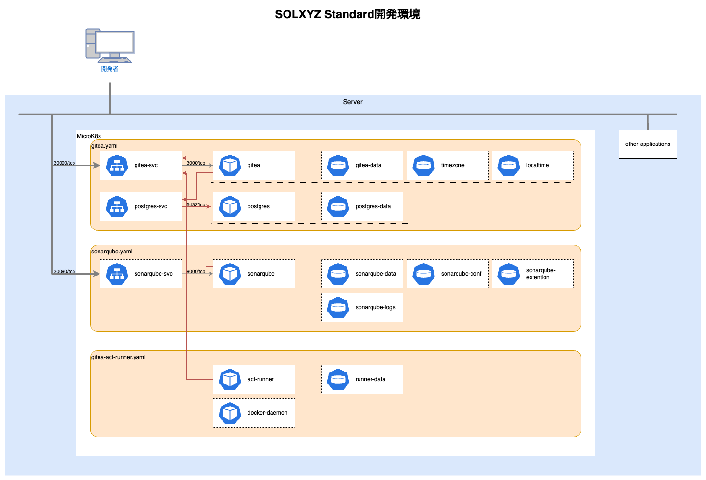

<!-- table -->
| ボリューム名 | ホストOSの保存パス | 説明 |
| --- | --- | --- |
| gitea-data | /var/microk8s/gitea/data | Giteaのデータ（リポジトリなど） |
| timezone | /etc/timezone | Hostで設定されたタイムゾーンを共有（読み込み専用） |
| localtime | /etc/localtime | Hostで設定されたローカルタイムを共有（読み込み専用） |
| postgres-data | /var/microk8s/postgresql/data | PostgreSQLのデータ |
| sonarqube-data | /var/microk8s/sonarqube/data | SonarQubeのデータ |
| sonarqube-conf | /var/microk8s/sonarqube/conf | SonarQubeの設定 |
| sonarqube-extensions | /var/microk8s/sonarqube/extensions | SonarQubeの拡張プラグイン |
| sonarqube-logs | /var/microk8s/sonarqube/logs | SonarQubeのログ |

## Giteaの設定

デプロイしたホストOS上のIPアドレスが必要になります。

ブラウザで以下のURLにアクセスしてください。

```
http://<ホストOSのIPアドレス>:30000
```

### Giteaの初期設定

Giteaの初期設定を行います。

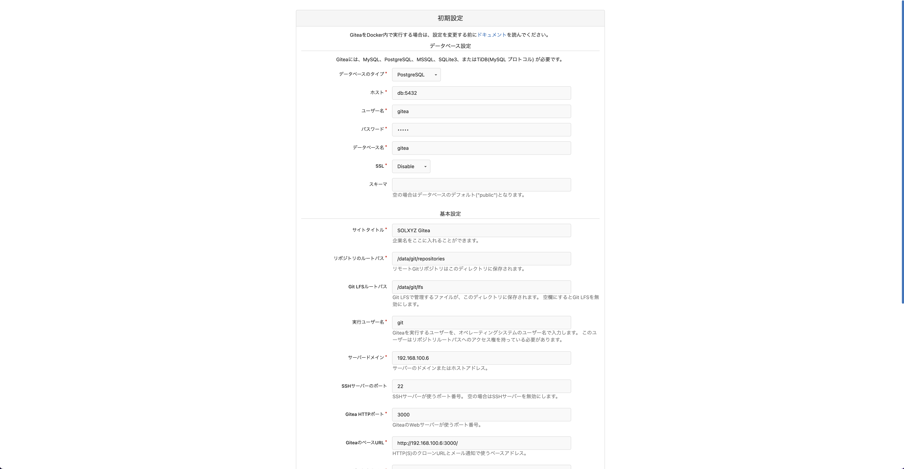

#### データベース設定

データベース設定は、Giteaのデータを保存するDBを設定します。

ソルクシーズスタンダードでは、PostgreSQLを利用しており、設定済みです。

この接続情報の初期入力された値は、配布したyamlファイルに設定されているものと同じです。

すべての項目で初期値から設定を変更する必要はありません。

#### 基本設定

基本設定は、Giteaの基本的な設定を行います。

##### サイトタイトル

サイトタイトルは、Giteaにアクセスした際に表示されるタイトルです。

プロジェクトの名前など、任意の値を入力してください。

##### リポジトリルートパス

リポジトリルートパスは、Giteaのリポジトリの保存場所を指定するパスです。

初期値から設定を変更する必要はありません。

##### Git LFSルートパス

Git LFSルートパスは、GiteaのGit LFSの保存場所を指定するパスです。

初期値から設定を変更する必要はありません。

##### 実行ユーザー

実行ユーザーは、Giteaアプリケーションを実行するユーザーを指定します。

初期値から設定を変更する必要はありません。

##### サーバードメイン

サーバードメインは、Giteaを公開しているサーバーのIPアドレス、またはドメインを指定します。

適切な値を入力してください。

##### SSHサーバーのポート

SSHポートは、GiteaにSSHでアクセスする際のポート番号を指定します。

初期値から設定を変更する必要はありません。

##### Gitea　HTTPポート

Gitea HTTPポートは、GiteaにHTTPでアクセスする際のポート番号を指定します。

初期値から設定を変更する必要はありません。

##### GiteaのベースURL

GiteaのベースURLは、Giteaにアクセスする際のURLを指定します。

通常は、`http://<サーバードメイン>:<Gitea HTTPポート>`となります。

適切な値を入力してください。

初期設定から変更を行う場合は、該当箇所を変更してください。

#### 設定完了後

設定値を入力後に、`Giteaをインストール`をクリックしてください。
この際に、2つ同一のボタンがありますが、どちらを押しても問題ありません。

この初期設定で、PostgreSQLのテーブルの設定や`app.ini`などの設定が行われます。

初期設定が完了すると、トップ画面に遷移します。

設定の変更が必要な場合、`app.ini`を編集する必要があります。

### Giteaの管理者ユーザーの作成

Giteaの管理者ユーザーを作成します。

Giteaの管理者ユーザーとは、このホスティングされたGiteaのすべての設定を変更できるユーザーです。管理者ユーザーは、リポジトリの管理者とは異なります。

管理者ユーザーは、Giteaの登録画面から作成することができます。

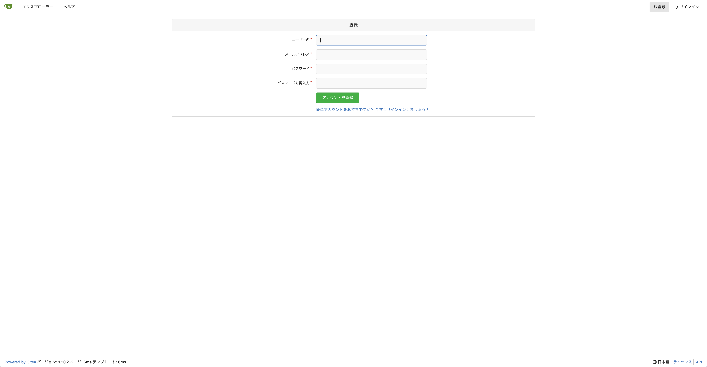

作成が完了すると、ユーザーのホーム画面に遷移します。

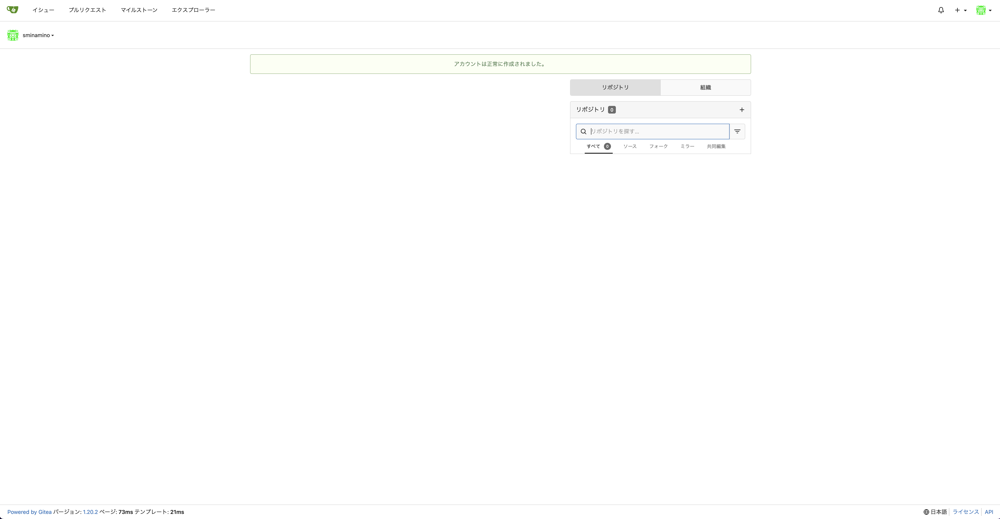

最初に作成したユーザーが管理者ユーザーになります。

### Gitea Actionsの有効化

Gitea Actionsを有効化します。

Gitea Actionsは、Gitea上でCI/CDを行うための機能です。

CI/CDとは、ソフトウェア開発において、ソースコードの変更を自動で検知し、自動でビルドやテストを行う仕組みです。

Gitea Actionsを有効化するには、Giteaの設定ファイルである`app.ini`を編集する必要があります。

設定ファイルは、`/var/microk8s/gitea/data/gitea/conf/app.ini`に保存されています。

設定ファイルに次の設定を追加してください。

```
[actions]
ENABLED=true
```

### ユーザー登録の無効化

Giteaでは、デフォルトでユーザー登録が有効になっています。

これは、誰でもユーザーの登録が可能なため、セキュリティ上の問題が発生する可能性があります。

ユーザー登録を無効化するには、Giteaの設定ファイルである`app.ini`を編集する必要があります。

設定ファイルは、`/var/microk8s/gitea/data/gitea/conf/app.ini`に保存されています。

設定ファイルに次の項目を変更してください。

```
DISABLE_REGISTRATION = true
```

### Giteaの再起動

`app.ini`の変更を行った場合、Giteaの再起動を行う必要があります。

今回は正常に設定が行われているかの確認のために、OSの再起動を行います。

```bash
$ sudo reboot -h now
```

## Giteaのユーザー管理

Giteaにユーザーを追加するには、Giteaの管理者権限が必要です。

管理者権限が付与されたユーザーでログインしてください。

`サイト管理`をクリックし、Giteaの管理画面に遷移します。


サイドバーから`ユーザーアカウント`を選択し、`ユーザーアカウントの作成`からユーザーを作成します。

このユーザーは、Giteaにログインするためのユーザーです。

ユーザーの登録機能を無効化している場合は、この操作でのみ、ユーザーを作成することができます。

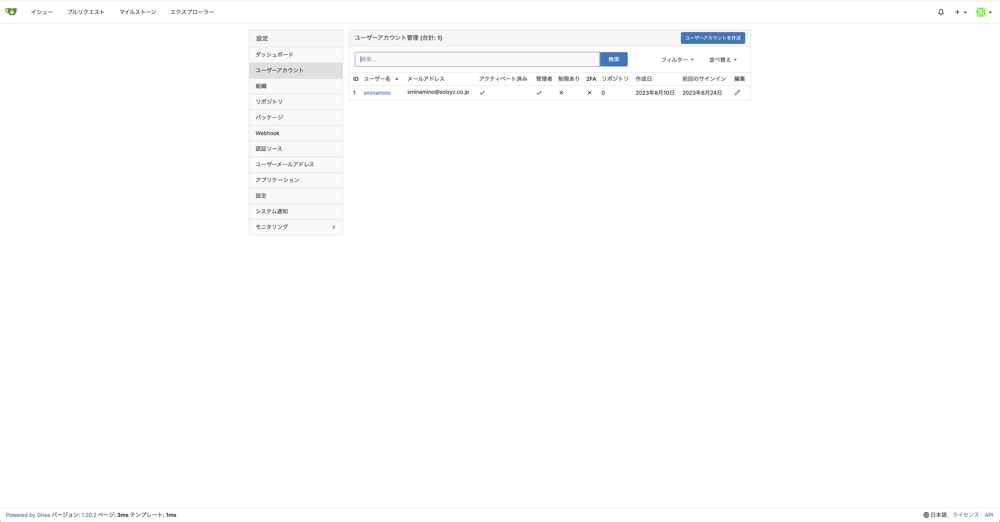

## Giteaのリポジトリ管理

リポジトリの作成は、特に権限は必要ありません。

ただし、レビュワーが複数人いる場合やチームで管理する場合は、組織を作成すると効率がよく開発を行うことができます。

### 組織の作成

組織は、複数人でリポジトリを管理するための機能です。

デフォルトでリポジトリを作成する場合、リポジトリにアクセスするURLは、`<ユーザー名>/<リポジトリ名>`という形式になります。

この状況では、そのユーザーが今後プロジェクトから脱退した場合に、リポジトリの移管が必要になります。

そういった事態を防ぐために、組織を作成することで、組織内のユーザーでリポジトリを管理することができます。

少人数のプロジェクトでなければ、組織を作成し、リポジトリを管理することをおすすめします。

組織を作成するためには、ホーム画面の`組織`の`+`をクリックします。

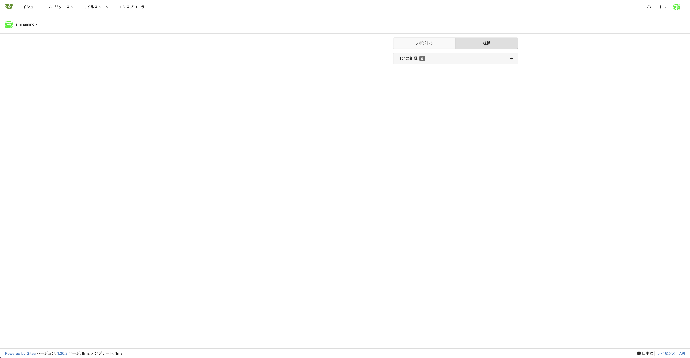

組織の設定を任意で行い、`組織を作成`をクリックします。

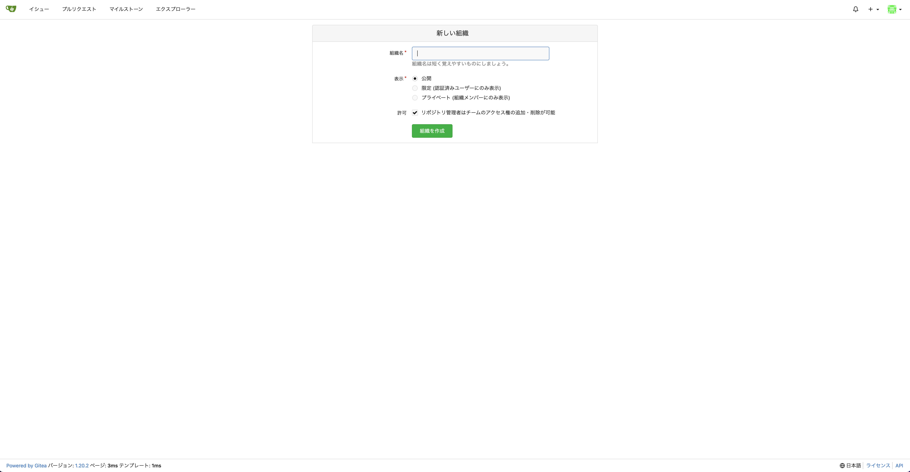

作成が完了すると、組織のホーム画面に遷移します。

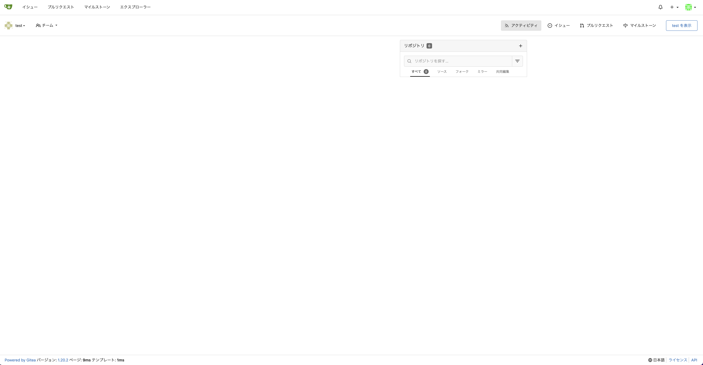

`<組織名>を表示`ボタンをクリックすると、現在の組織に属しているリポジトリ、メンバー、チームなどを確認できます。

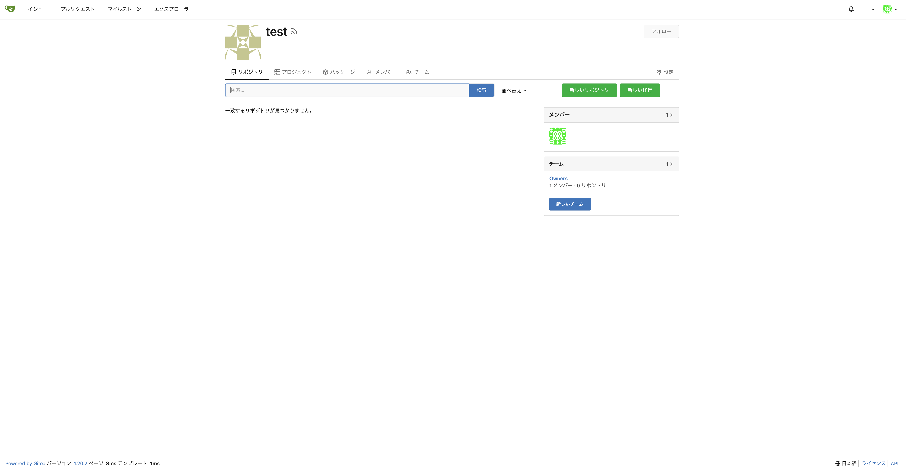

初期から作成されているチームの`Owner`は組織の管理者のチームです。

ここに追加したメンバーは、組織の管理者権限を持つことになります。

通常、プロジェクトの上位に位置する（たとえばマネージャーやリーダーなど）を所属させることをおすすめします。

一般のメンバーは、`Members`チームに所属させることをおすすめします。

このように権限を適切に設定することで、リポジトリの設定を行う権限を制限することができます。

大規模開発の場合では、チームをさらに細分化することで、リポジトリの設定を行う権限を細かく制限することができます。

たとえば、`online`や`batch`を分けるなどの方法があります。

チームに属している権限のみ、メンバーは閲覧権限があります。

チーム外のissueなど、タスクに不要な情報をフィルターすることで生産性を向上させる効果が期待できます。

### リポジトリの作成

リポジトリの作成は、組織の作成と同様に、ホーム画面の`リポジトリ`の`+`をクリックします。

この時、オーナーを組織に設定することで、組織のリポジトリとして作成することができます。

.gitignoreの設定のテンプレートも設定できます。

#### .gitignoreファイルの活用

.gitignoreファイルは、Gitで管理するファイルやディレクトリを除外するための設定を行うファイルです。

これは、ビルド成果物や、開発者個人の設定ファイルなどを除外するために利用します。

この設定を行うことで、不要なファイルを自動的に無視することで、リポジトリをきれいに保ちます。

##### .gitignoreテンプレート

幸いなことに、多くの開発ツールやフレームワークでは .gitignore のテンプレートが提供されています。例えば、Giteaには.gitignoreのテンプレートが用意されており、Javaでバージョン管理する必要のないファイルやEclipseの不要なファイルなどが含まれています。

しかしながら、これらのテンプレートは全ての可能性を網羅しておらず、プロジェクト固有の必要性に応じてカスタマイズが必要な場合もあります。

##### .gitignoreファイルの作成

.gitignoreファイルを作成する際に便利なツールもあります。例えば[Toptal](https://www.toptal.com/developers/gitignore)では、プロジェクトに適した.gitignoreファイルを作成することができます。

さらに詳しい.gitignoreの解説は、[GitHubの公式ドキュメンテーション](https://docs.github.com/ja/get-started/getting-started-with-git/ignoring-files)で確認できます。

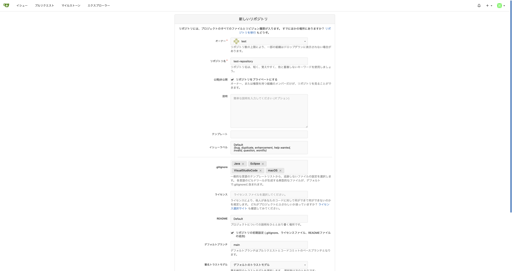

作成したリポジトリの設定から、任意のチームの閲覧権限を追加することができます。
※アクセス権限はチーム作成時に設定する項目です。

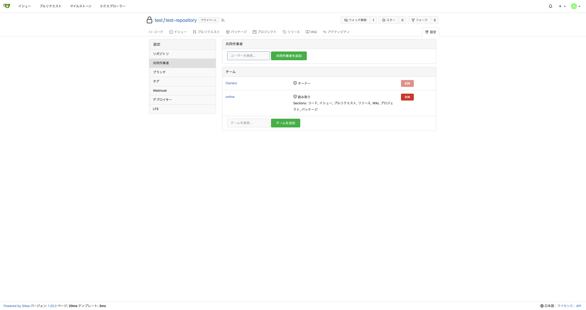

## Gitea Actionsの設定

Gitea Actionsの設定には、Giteaの管理者権限が必要です。

管理者権限が付与されたユーザーでログインしてください。

`サイト管理`をクリックし、Giteaの管理画面に遷移します。


Actionsのランナーを選択します。

ランナーとは、Gitea Actionsのジョブを実行するための仮想マシンです。

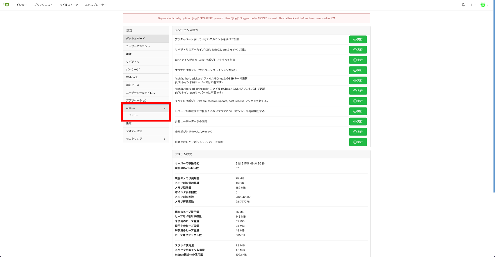

`新しいランナーの作成`からREGISTRATION TOKENをコピーします。

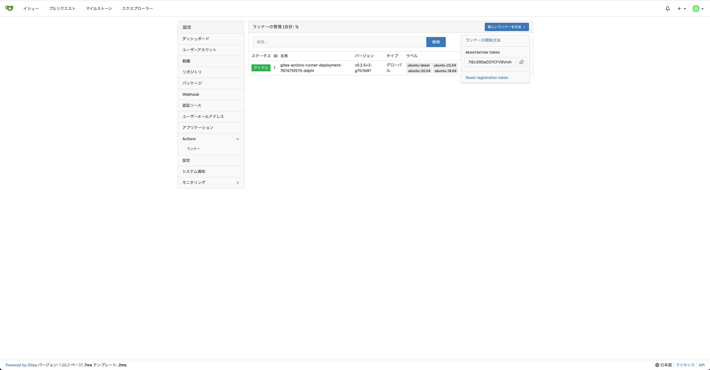

コピーしたTokenを配布したK8sのリソースファイル`gitea-act-runner.yaml`の`token`に設定します。

```yaml
apiVersion: v1
stringData:
  token: <ここに入力する>
kind: Secret
metadata:
  name: runner-secret
type: Opaque
```

このファイルをK8sに適用します。

```bash
$ kubectl apply -f gitea-actions.yaml
```

追加が完了すると、Giteaの画面にRunnerが追加されていることが確認できます。

※Runnerの追加には、少し時間がかかります。

 OSの再起動などで、RunnerのTokenが有効期限切れになった場合は、再度Tokenを設定してください。

### リポジトリの設定

リポジトリの設定画面からActionsの有効化にチェックを入れることで、Actionsを有効化することができます。

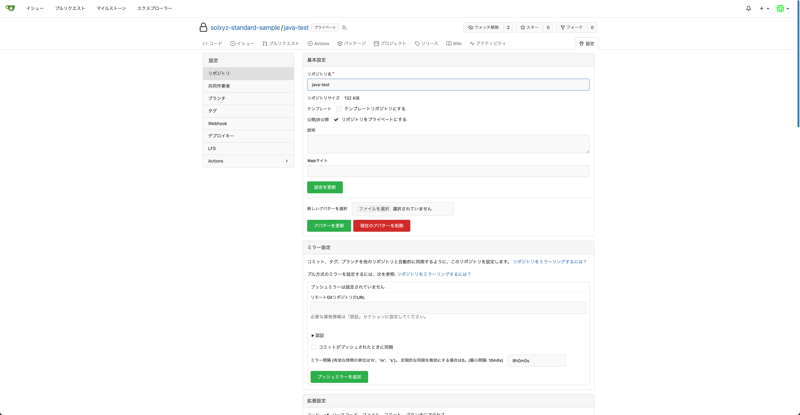

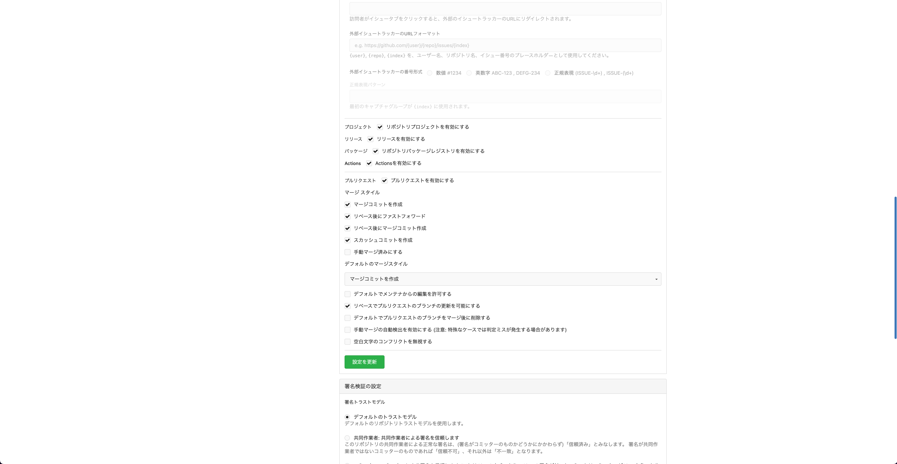

追加が完了すると、リポジトリの画面にActionsのタブが追加されていることが確認できます。

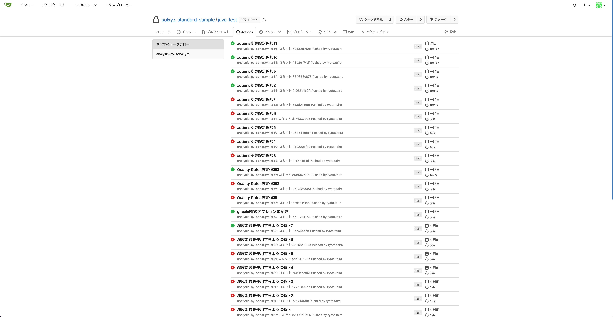

ワークフローを作成し、特定のブランチにpushやpull requestが行われた場合に実行されるように設定することができます。

具体的な使用方法は、[SonarQubeセットアップ手順](../sonarqube/SonarQubeセットアップ手順.md)に記載しています。
