# GitHub Flowを活用する

GitHub Flowは、Git運用における主要なワークフローの1つです。

GitHub Flowは、非常に柔軟なワークフローであり、チームのニーズに合わせてカスタマイズできます。

## GitHub Flowの手順

以下は、GitHub Flowを使用してコードをリリースするための一般的な手順です。

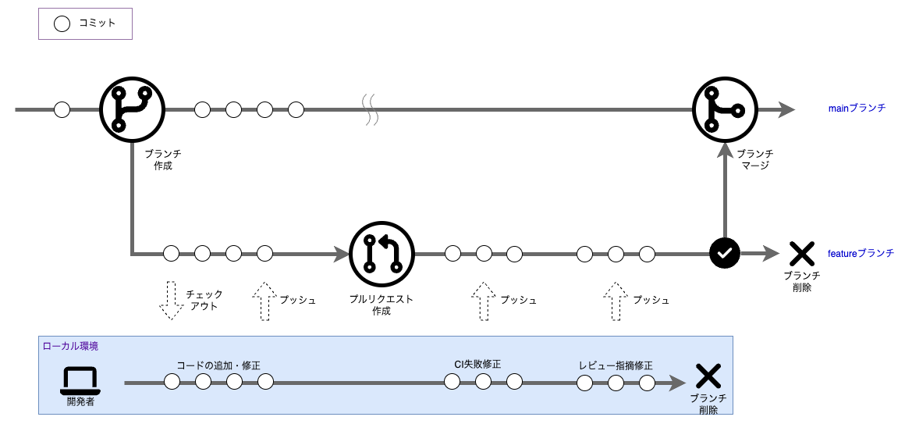

### 1) ブランチの作成

新しい機能や修正を行う場合は、mainブランチから新しいブランチを作成します。

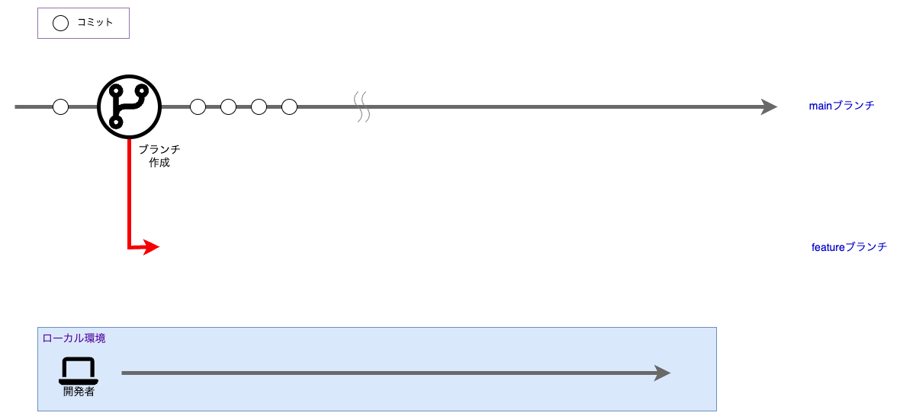

### 2) コードの変更

新しいブランチをローカルにチェックアウトし、コードの変更作業を行います。

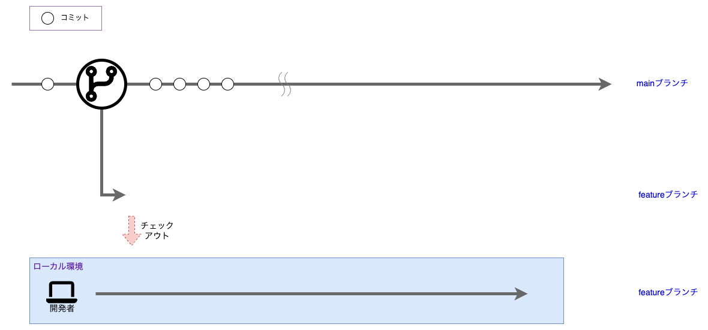

### 3) コミット

修正や機能追加などの変更が完了したら、変更内容をコミットし、ローカルブランチに保存します。

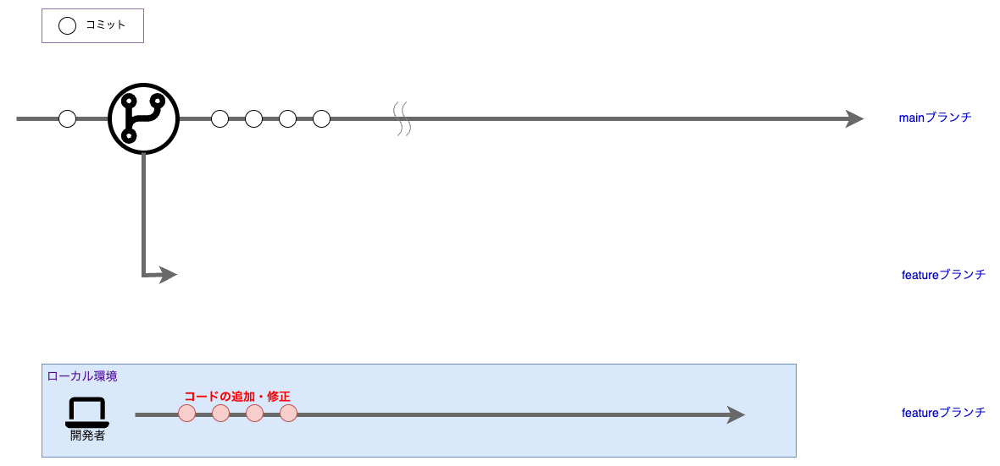

### 4) リモートへプッシュ

ローカルブランチにコミットした変更内容を、リモートのブランチにプッシュします。

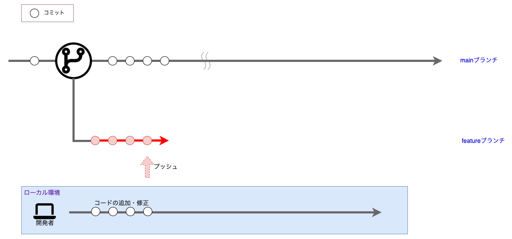

### 5) プルリクエストを作成

コードの変更が完了したら、リモートのブランチからプルリクエストを作成します。

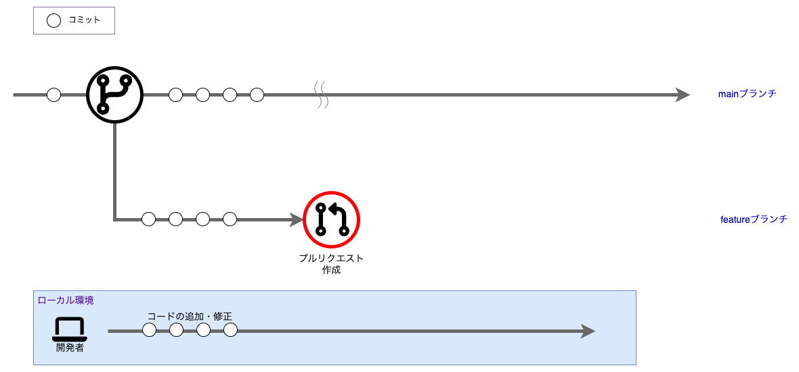

### 6) Gitea ActionsによるCI

プルリクエストを作成すると、Gitea ActionsによるCIが実行されます。

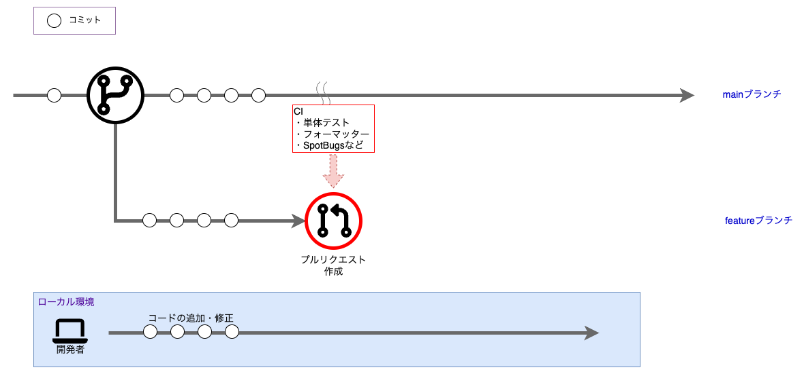

CIは、プルリクエストがオープンな時、pushをトリガーとして自動で実行されます。

CIには、次のような利点があります。

- テストの自動化

  CIを使用すると、コードの変更に対して自動化されたテストを実行できます。
  テストは、コードの変更によって破損したり、意図しない変更が行われたりすることを防ぐのに役立ちます。
- コードの品質を維持する

  CIを使用すると、コードの品質を維持するための静的解析を実行できます。
  静的解析は、スレッドセーフでないコードの検出、コードの重複の検出、コードの複雑さの検出などを行うことができます。また、フォーマッターやcheckstyleなどのツールを使用して、コードのフォーマットを統一することもできます。
- ビルドの自動化
  
  CIを使用すると、コードの変更に対して自動化されたビルドを実行できます。
  ビルドは、コードの変更によって破損したり、意図しない変更が行われたりすることを防ぐのに役立ちます。

これはすべて機械的に行われるため、レビュワーはこれらの作業を行う必要はありません。

レビュワーが行うべきことは、コードの変更に対するレビューと、変更が問題ないことを確認することです。

CIが失敗した場合は、プルリクエストをレビュー依頼する前に、問題を修正する必要があります。

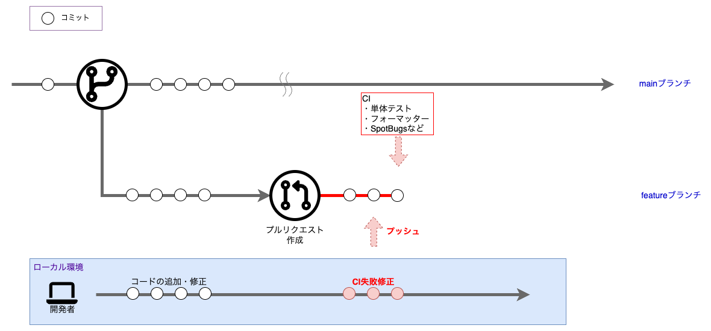

すべてのCIジョブが成功したら、プルリクエストをレビュー依頼します。

### 7) コードレビューを依頼

プルリクエストを作成、すべてのCIジョブが成功したら、コードレビューを依頼します。

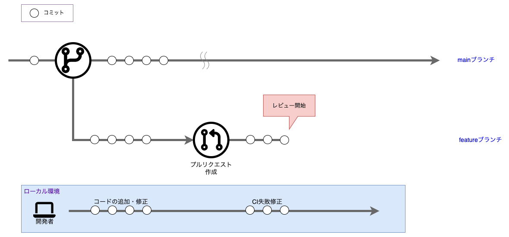

レビュー指摘を（2）～（4）と同様に修正、コミット、プッシュをして反映します。

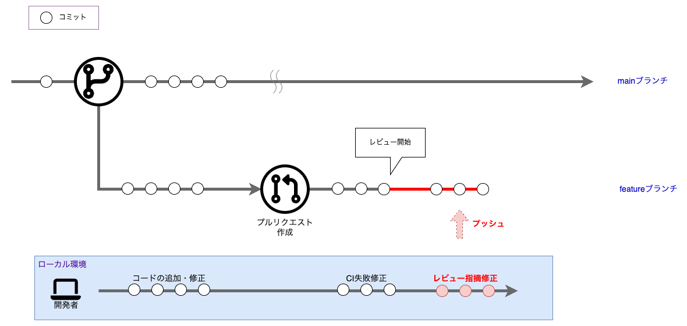

この工程は、レビュワーが承認するまで繰り返されます。

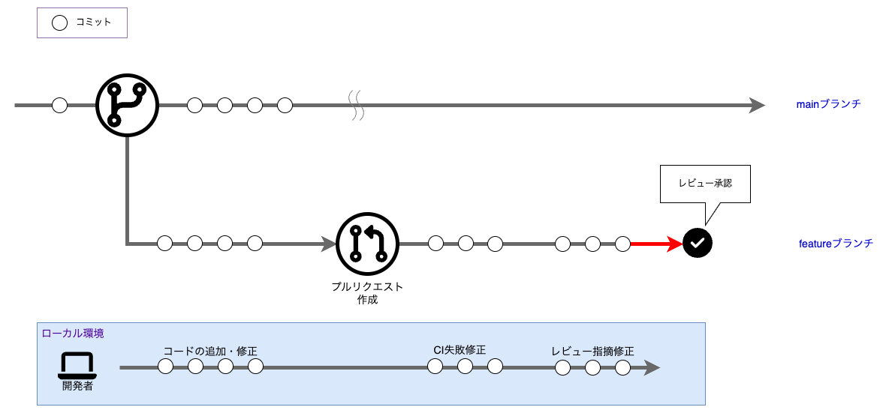

### 8) コードをmainブランチにマージ

プルリクエストが承認されたら、コードをmainブランチにマージします。

mainブランチとコンフリクトを起こし、マージできない場合があります。

その場合は、mainブランチから現在作業を行なっているブランチにマージを行い、コンフリクトを解消させてください。

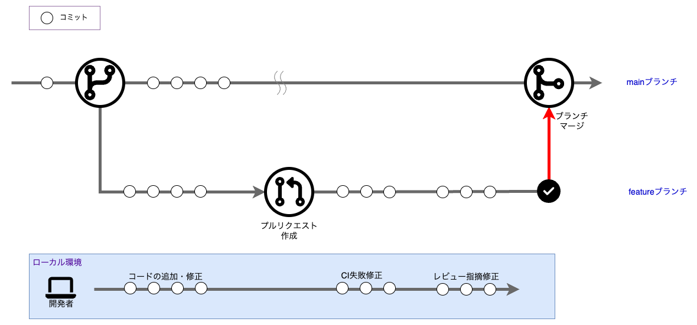

マージが完了したら、ブランチを削除します。

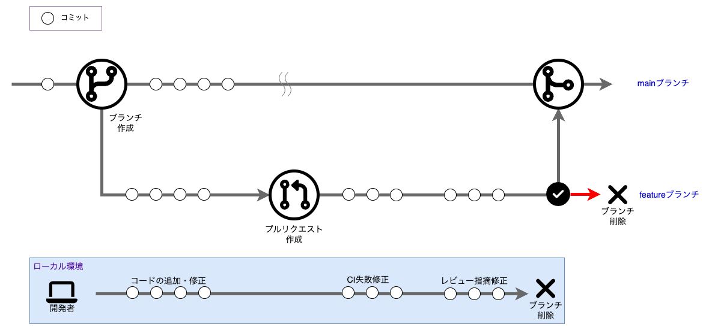

### 9) デプロイ

プルリクエストにてコードのマージが完了した後、mainブランチのコードのデプロイを行います。

## GitHub Flow活用のヒント

### ブランチを小さく、重点を置いて分割する

ブランチを小さく、重点を置いて分割することで、変更のレビューとマージが容易になり、競合（コンフリクト）のリスクも減少します。

原則として、ひとつのタスク、または機能に分割します。

### コミットの粒度を小さくする

一度にコミットするコードは小さくなっていることが望ましいです。

小さなコミットには次のような利点があります。

- リバート（変更を元に戻す）が容易になる

  誤った変更を行ってしまった場合、元に戻せる最小単位はコミットです。大きな単位でコミットをしてしまうと、リバートが必要になった場合、戻したい変更のみならずその他の変更も一緒に戻さなくてはいけません。

- ブランチのマージが容易になる

  コミットが大きい場合、変更点が複数のファイルにまたがる可能性があります。これにより、マージに時間を要し、競合（コンフリクト）の可能性が高まります。

- コミットメッセージがわかりやすくなる

  コミットメッセージは、変更点を説明するために非常に重要です。小さなコミットは、変更点を単純明快に説明することができるため、コミットメッセージが読みやすくなります。

### 明確なコミットメッセージを記述する

変更内容とその理由を説明する明確なコミットメッセージを書くことで、他の開発者の理解を助け、何か問題が発生した場合に問題の追跡が容易になります。

よくない例は「○○の修正」のような情報が何もないメッセージです。

よい例：

```script
修正：ユーザーリストの表示順序の変更

ユーザーリストはIDの昇順で表示されているが、要件と異なる。

初期表示時は氏名カナの昇順とする。
```

### コードベースを最新に保つ

ローカルで変更中のファイルが、mainブランチにて更新されているかもしれません。

コンフリクトの範囲を広げないために、定常的にmainブランチを作業中のブランチにマージする習慣をつけることが大切です。

### コードレビューにはプルリクエストを使用する

プルリクエストを使用すると、変更内容についてのフィードバックを受けることができます。

レビューを依頼し、フィードバックを得て、問題や懸念事項について議論するために使用してください。

プルリクエストのテンプレートを作成しておくことで、開発者全員が同じ基準でレビュアーに情報提供できます。

### 注意深くコードをレビューする

コードをレビューする際には、時間をかけて各変更を注意深くレビューしてください。

バグ、読みやすさの問題、エッジケースを探してください。

変更がコードベースの他の部分にどのように影響するかを考えてください。

### 他の開発者と明確にコミュニケーションを取る

GitHub Flowで効果的に協力するためには、良好なコミュニケーションが重要です。

コメントやフィードバックを明確かつ簡潔にし、敬意を持って建設的に取り組んでください。

### 変更を十分にテストする

変更をマージする前に、それらが期待通りに機能することを確認するために十分にテストしてください。

自動テストを実行したり、コードを手動でテストしたり、ステージング環境を使用したりすることがあります。

## Gitコマンドチートシート

GitHub公式トレーニングの[Gitチートシート](https://training.github.com/downloads/ja/github-git-cheat-sheet/)は非常に便利です。

ブラウザのお気に入りに入れたり、印刷していつでも見られるようにしておきましょう。

Gitのコマンドは裏で何が実行されているかを把握することが重要です。

正しい認識で覚えましょう。
