# GiteaでのGitHub Flow活用例

本書ではGitHub FlowをGitea上でどのように実現するかを記述します。

資料「GitHub Flowを活用する」も併せて参照してください。

## 1) ブランチの作成

新しい機能や修正を行う場合は、`main`ブランチから新しいブランチを作成します。

ブラウザでGiteaを表示します。

リポジトリの［コード］-［ブランチ］の順に表示し、`main`ブランチ右側の「'`main`'から新しいブランチを作成」を押下します。

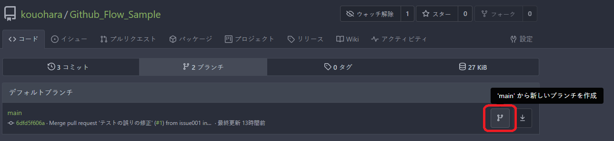

ブランチ名を求められるので、任意のブランチ名を入力して、「ブランチの作成」を押下します。

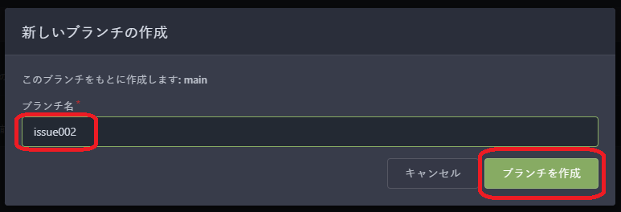

ブランチ名はプロジェクトの規則に従います。

規則がない場合はチーム内で事前にルールを作成することを提案しましょう。

## 2) コードの変更

新しく作成したブランチにて、コードの変更作業を行います。

新しく作成したブランチをchaeckoutします。

```script
git checkout <branch name>
```

### チェックアウト手順（Eclipse）

Eclipseなどの統合環境のプラグインを活用できます。

［ウインドウ］-［ビューの表示］-［その他］-［Git］-［Gitリポジトリ］の順に押下します。

> ［Git］-［Gitリポジトリ―］が表示されない場合は付録「EGitのインストール」参照

リポジトリを右クリックし、［originからフェッチ］を押下して、作成したブランチを表示します。

表示されたリモートリポジトリを右クリックして［チェックアウト］を押下します。

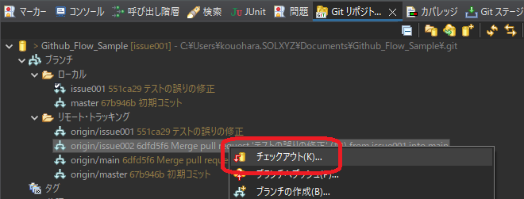

確認ダイアログが表示されるので、［新規ローカル・ブランチとしてチェック・アウト］を押下します。

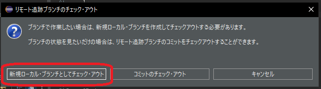

［ブランチの作成］ダイアログで［完了］を押下します。

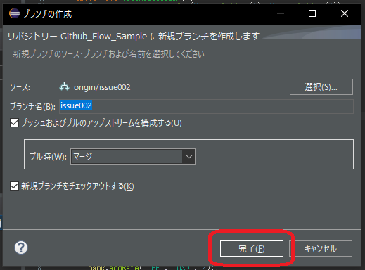

## 3) コミット

修正や機能追加などの変更が完了したら、変更内容をコミットし、ローカルブランチに保存します。

```script
git add .
git commit -m <コミットコメント>
```

### コミット手順（Eclipse）

［ウインドウ］-［ビューの表示］-［その他］-［Git］-［Gitステージング］の順に押下します。

［ステージされていない変更］に表示されているコミット対象のファイルを選択し、［＋］を押下して、［ステージされた変更］に移動します。

右側［コミットコメント］を入力し、［コミット］を押下します。

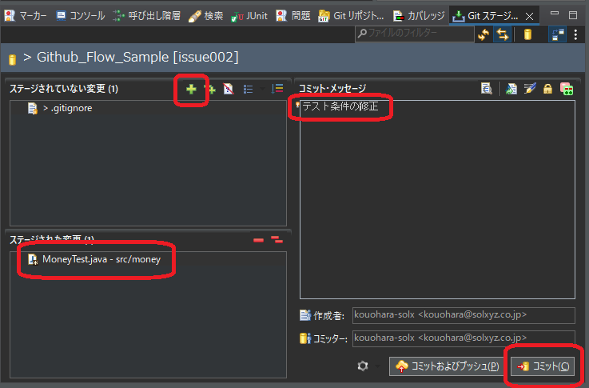

## 4) リモートへプッシュ

ローカルブランチにコミットした変更内容を、リモートのブランチにプッシュします。

```script
git push
```

Giteaが認証を要求するので、IDとパスワードを入力します。

### プッシュ手順（Eclipse）

プロジェクトを右クリックし、［チーム］-［ブランチのプッシュ］の順に押下します。

［ブランチのプッシュ］が表示されるので、［プッシュ］を押下します。

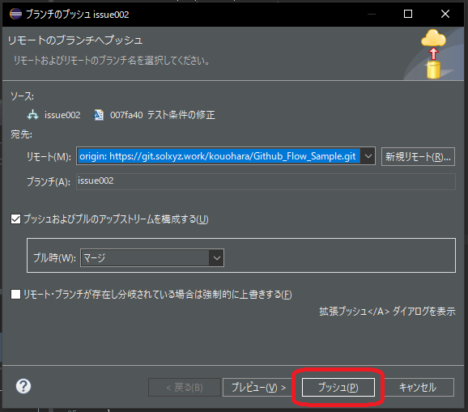

［プッシュ結果］が表示されます。

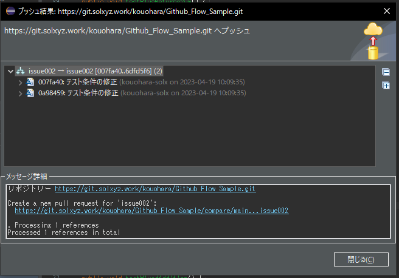

## 5) プルリクエストを作成

コードの変更が完了したら、リモートのブランチからプルリクエストを作成します。

ブラウザでGiteaを表示します。

［プルリクエスト］-［新しいプルリクエスト］を押下します。

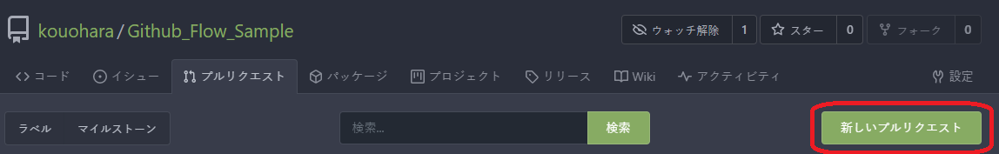

［新しいプルリクエスト］画面が表示されます。

［プル元］に変更したブランチを選択し、［新しいプルリクエスト］ボタンを押下します。

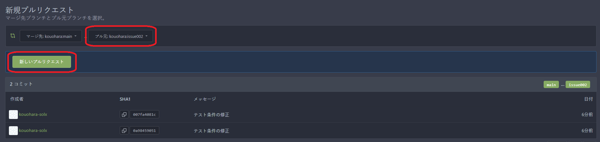

コメント入力画面が表示されるので、レビューアーに伝える情報を入力し［プルリクエストを作成］を押下します。

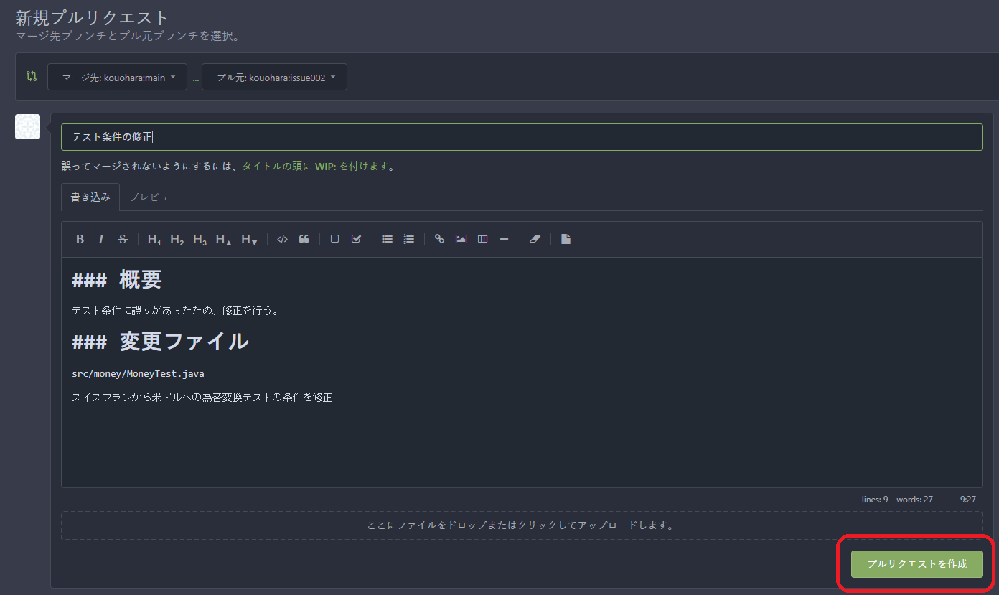

コメントに記載する内容はプロジェクトの規則に従います。

規則がない場合はチーム内で事前に作成することを提案しましょう。

テンプレート機能の利用も検討します。

## 6) コードレビューを依頼

プルリクエストを作成すると、他の開発者にコードレビューを依頼することができます。

プルリクエストを作成すると、Gitea Actionsが実行されます。

実行結果は`Actions`タブから確認できます。

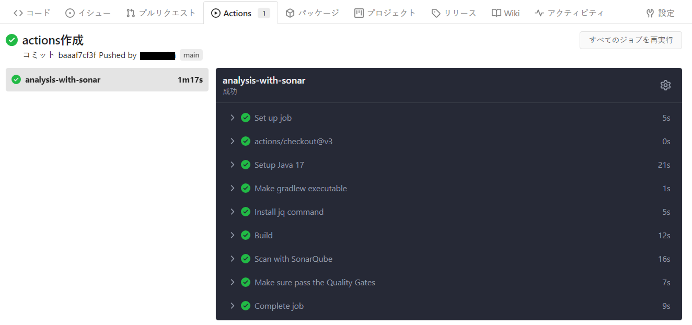

CIが失敗した場合は、プルリクエストをレビュー依頼する前に、問題を修正する必要があります。

### コードレビューの実施方法

プルリクエストの［変更されたファイル］タブを開くとファイルに対してレビューコメントを残せます。

コード内の左側の［＋］を押下すると、コメント欄が表示されるので、コメントを入力して、［レビュー開始］を押下します。

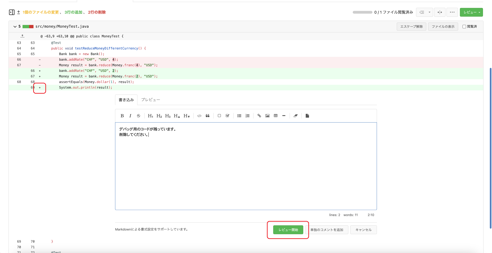

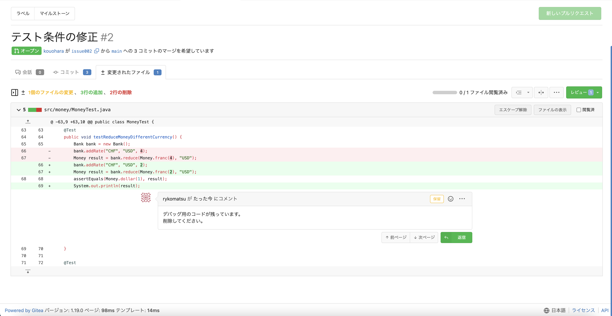

コメントを入れ終えたら、レビューを投稿します。

右上の［レビュー］を押下して、レビューコメントを入力し、［変更要請］を押下します。

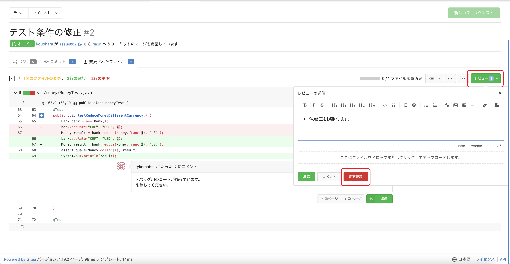

レビュー対象に問題がなく、承認する場合は［承認］を押下します。

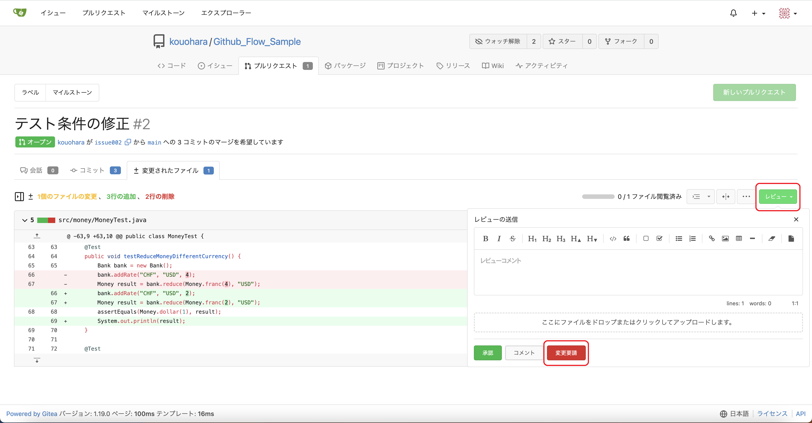

レビュー指摘をもらったら（2）～（4）と同様に修正、コミット、プッシュをして反映します。

## 7) コードをmainブランチにマージ

プルリクエストが承認されたら、コードをmainブランチにマージします。

［マージコミットを作成］を押下して、マージします。

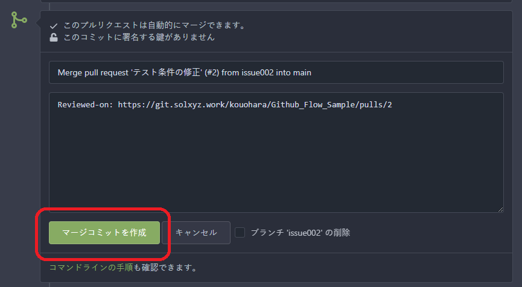

マージが完了したら、不要なブランチを削除します。

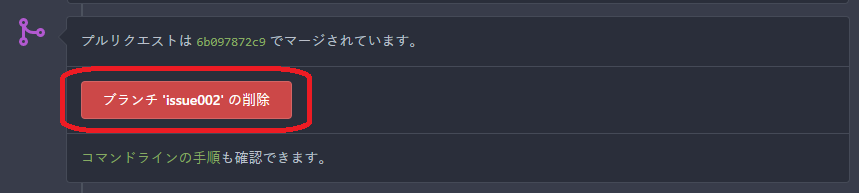

## 付録

### EGitのインストール手順（Eclipse）

[EGitのインストール](https://sukkiri.jp/technologies/devtools/git/egit_win.html)はこちらを参照してください。

### プルリクエストテンプレートの作成

次のリンクに記載されているように、ルートディレクトリ配下に次のマークダウンファイルを作成します。

.￥.gitea￥PULL_REQUEST_TEMPLATE.md

[Syntax for markdown template](https://docs.gitea.io/en-us/issue-pull-request-templates/#syntax-for-markdown-template)
