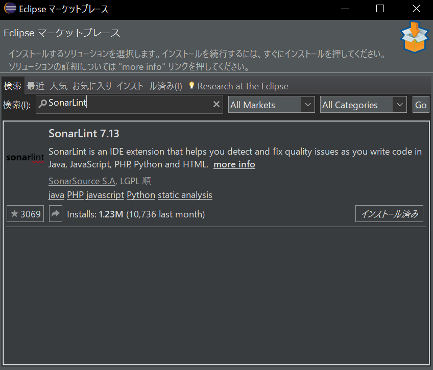
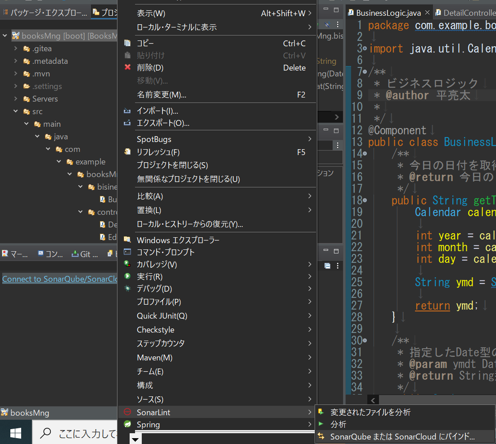
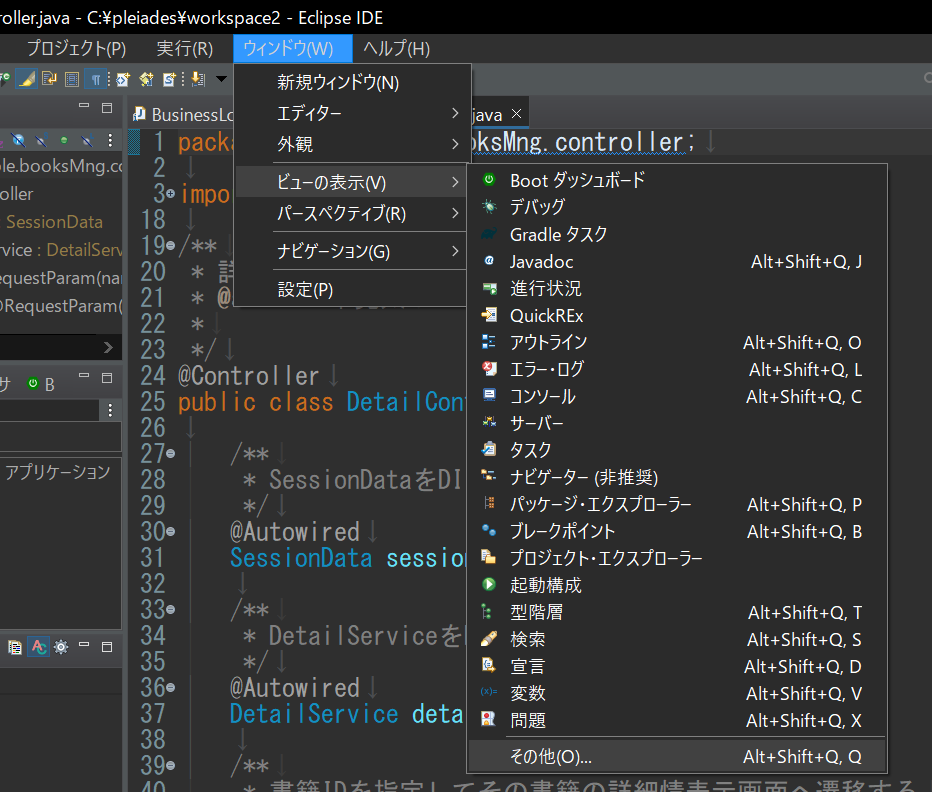
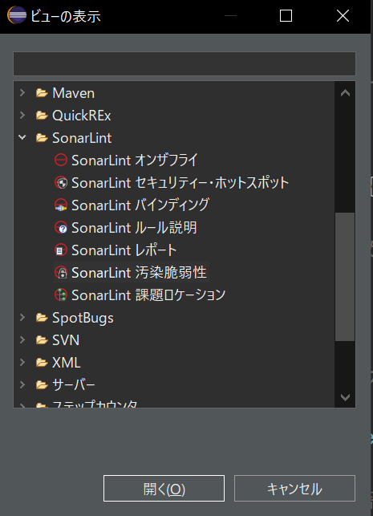
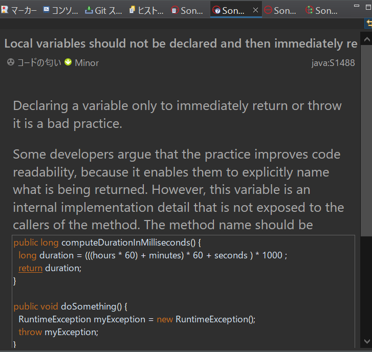
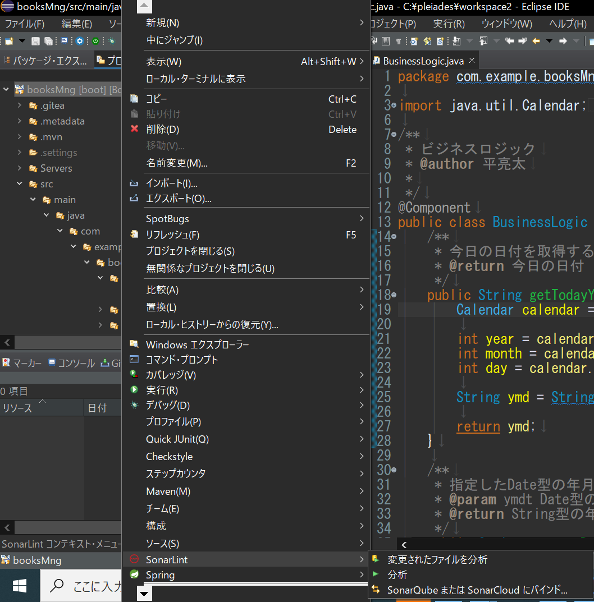
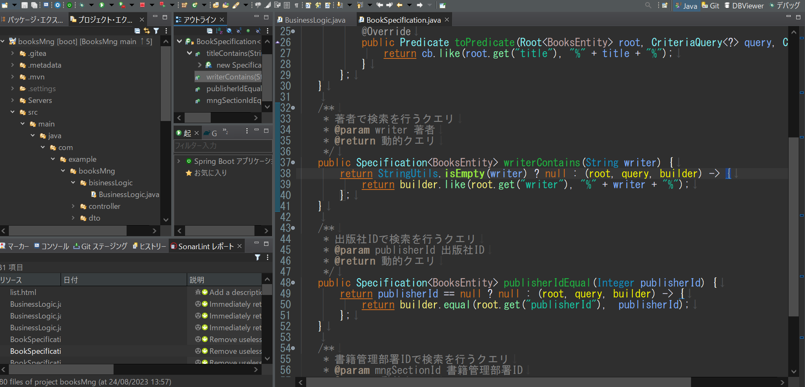

# EclipseでSonarLintを使用する

## SonarLint設定手順

### マーケットプレイスからプラグインをインストールする

1. Eclipseを起動します
2. 画面上部のメニューバーから、**ヘルプ**をクリックします
3. Helpメニューから、**Eclipse Marketplace**をクリックします
4. Eclipse Marketplaceダイアログが表示されます 
   **検索**タブを選択し、検索ボックスに`SonarLint`と入力して検索ボタンをクリックします
5. 検索結果に表示された**SonarLint**の項目で、**インストール**ボタンをクリックします 
   
6. インストールするコンポーネントを確認して**確認**をクリックします
7. ライセンスに同意する項目を選択し、**完了**をクリックします
8. インストールが完了したら、Eclipseを再起動するよう求められるので、ダイアログで**再起動**をクリックしてEclipseを再起動します

### オンラインのSonarQubeと同期する

設定が必須ではないですが、オンライン同期には次のような利点があります。

- **共有されたルール**: SonarQubeに定義されたカスタムルールがEclipse内のSonarLintプラグインで適用されます。これにより、チームメンバー間で一貫したコーディング規約を維持することができます。
- **False Positive（誤検出）の管理**: SonarQube上でFalse PositiveやWon't Fixとしてマークされた問題は、SonarLintでも同期され、マーカー表示されなくなります。これにより、既知の誤検出や対応の予定がない問題に対して再度注意を払わなくても済むようになります。
- **課題の同期**: SonarQubeで検出された課題がSonarLintに同期され、開発者がローカルで編集中に課題を確認・修正できるようになります。これにより、問題の修正が容易になります。

次に設定手順を示します。

1. エクスプローラーに表示されているプロジェクト名を右クリックし、`SonarLint > SonarQubeまたはSonarCloudにバインドする`をクリックします 
   
2. `SonarQube`を選択し、`次へ`をクリックします
3. `Sonar Server URL`には`http://host名（or ホストのIPアドレス）:30090`を入力し、`次へ`をクリックします
4. `Choose authentication method`では`トークン`、`Username + Password`のどちらを選択しても問題ありません
   トークンの場合、[SonarQubeセットアップ手順書](./SonarQubeセットアップ手順.md)と同様の手順で、`Token Type`を`User Token`としてトークンを発行してください
5. 前の画面で選択した認証方法通りに認証を行います
6. `SonarQube Connection Identifier`では、接続名を自由に設定してください
7. `Configure Notifications`では**Receive notifications from SonarQube**を選択し、**次へ**をクリックします
8. **Connection successfully created**と表示されれば、接続成功です
9.  **完了**をクリックすると次にバインドするプロジェクトを選択する画面が表示されます 
    **追加**をクリックして対象としたいプロジェクトを選択し、**次へ**をクリックします
10. **Choose the SonarQube/SonarCloud project**ではSonarQubeに登録しているプロジェクト名を入力・選択し、**完了**をクリックします

これでSonarQubeとSonarLintがバインディングされ、ローカルでの分析にSonarQubeで定義されたルールや課題が適用されるようになります。

## リアルタイムでスキャンを行う

開いているファイルの自動スキャンはデフォルトで有効になっていますが、スキャン内容を表示するウィンドウは各自で設定する必要があります。

1. 画面上部のメニューバーから、**ウィンドウ**を選択し、次に **ビューの選択**をクリックします
2. **ビューの選択**サブメニューから **その他**をクリックします 
   
3. **SonarLint**の項目**SonarLint オンザフライ**を選択し、**開く**ボタンをクリックします 
    

SonarLintのビューにはいくつか種類があります。次にいくつか紹介します。

|ビュー名|説明|
|--|--|
|オンザフライ|コードを編集すると同時にリアルタイムでコード品質の問題を検出し、その指摘概要を表示します。|
|バインディング|オンラインのSonarQubeやSonarCloudとの連携状況を表示します。|
|ルール説明|オンザフライ等のウィンドウで指摘項目を選択すると、選択中の箇所が違反しているルールの詳細説明が表示されます。|
|レポート|プロジェクト全体のスキャンを行った際に、その結果を表示します。|

**SonarLint オンザフライ**のウィンドウを使用している状況を次に示します。

下図のように左下にあるウィンドウが**SonarLint オンザフライ**です。

ウィンドウには現在コードを表示しているファイルのスキャン結果が一覧で表示され、コード上では波線で指摘箇所が強調表示されます。

また、一覧内のアイテムをクリックすると、コード上の指摘箇所がさらに強調表示されます。

さらに、**SonarLint ルール説明**ウィンドウを表示している場合、下図のようにルールの詳細説明を見ることができます。

## プロジェクト全体をスキャンする

SonarQube同様にプロジェクト全体のスキャンを行うこともできます。

次にスキャン手順を示します。

1. エクスプローラーに表示されているプロジェクト名を右クリックし、`SonarLint > 分析`をクリックします 
   
2. しばらく時間がかかりますが、解析が完了すると**SonarLint レポート**ウィンドウに結果が表示されます 
    
   ウィンドウの使用方法は**SonarLint オンザフライ**と同様です
