# IntelliJ IDEAでSonarLintを使用する

## SonarLint設定手順

### マーケットプレイスからインストールする

次のリンクから拡張機能をインストールします。

[SonarLint](https://plugins.jetbrains.com/plugin/7973-sonarlint)

### オンラインのSonarQubeと同期する

設定が必須ではないですが、オンライン同期には次のような利点があります。

- **共有されたルール**: SonarQubeに定義されたカスタムルールがEclipse内のSonarLintプラグインで適用されます。これにより、チームメンバー間で一貫したコーディング規約を維持することができます。
- **False Positive（誤検出）の管理**: SonarQube上でFalse PositiveやWon't Fixとしてマークされた問題は、SonarLintでも同期され、マーカー表示されなくなります。これにより、既知の誤検出や対応の予定がない問題に対して再度注意を払わなくても済むようになります。
- **課題の同期**: SonarQubeで検出された課題がSonarLintに同期され、開発者がローカルで編集中に課題を確認・修正できるようになります。これにより、問題の修正が容易になります。

次に設定手順を示します。

1. アプリケーションの左端にあるプラグインの一覧の中からSonarLintをクリックします
2. SonarLint内の上部にあるタブから**Security Hotspots**をクリックします
3. まだオンラインとのコネクションがない場合、**Configure Binding**と表示されているのでクリックします 
   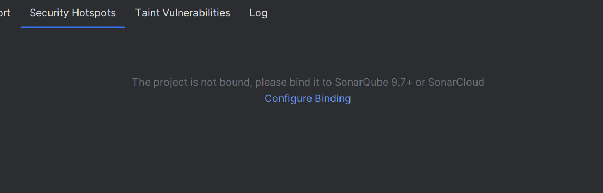
4. 表示されるポップアップ内の**Bind project to SonarQube / SonarCloud**のチェックボックスを埋め、**Configure the connection**のボタンをクリックします 
   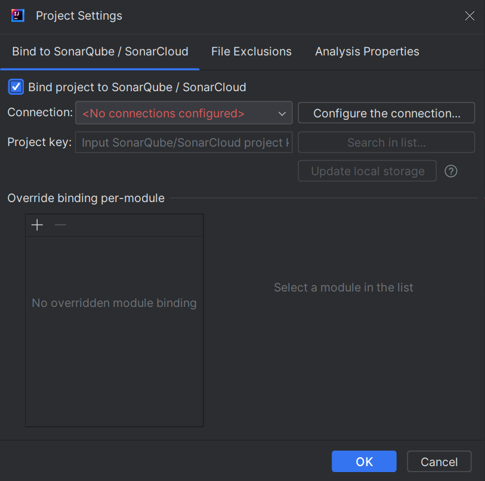
5. **SonarQube / SonarCloud connections**とタイトルのついている表の左上にある「＋」ボタンをクリックします 
   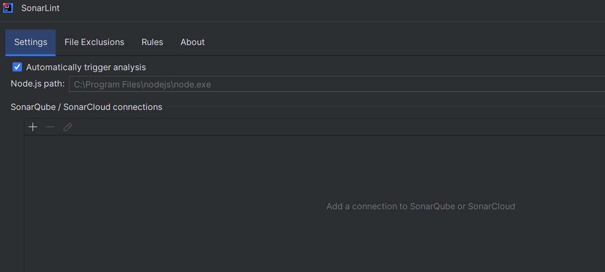
6. **Connection Name**を入力し、「SonarQube」を選択、**SonarQube URL**を入力し、**Next**をクリックします 
   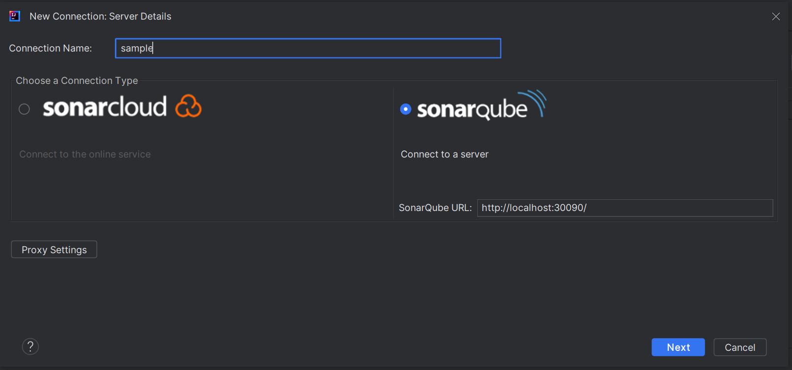
7. **Authentication type**を選択し、認証情報を入力し、**Next**をクリックします 
   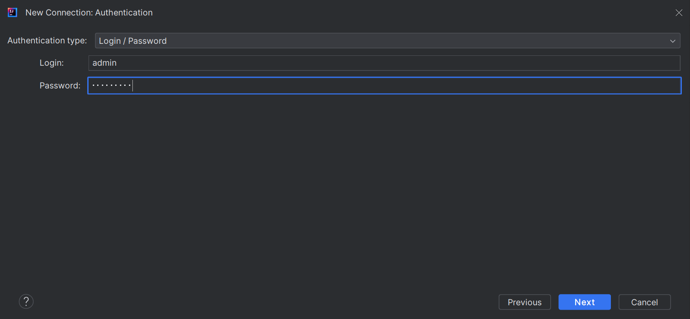
8. **Receive notifications from SonarQube**を選択し、**Next**をクリックします
9. ウィンドウにしたがって進めていくと下図のようなポップアップへ戻るので、先ほど作成したコネクションを選択し、**OK**をクリックします 
   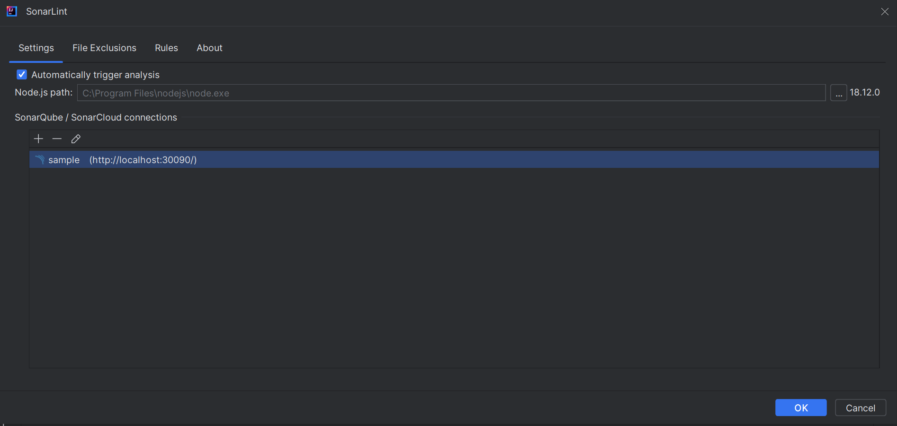
10. 下図のようなポップアップへ戻る**Connection**には先ほど作成したものを選択、**Project key**には**Search in list**からSonarQubeに作成してあるプロジェクトを選択し、**OK**をクリックします 
    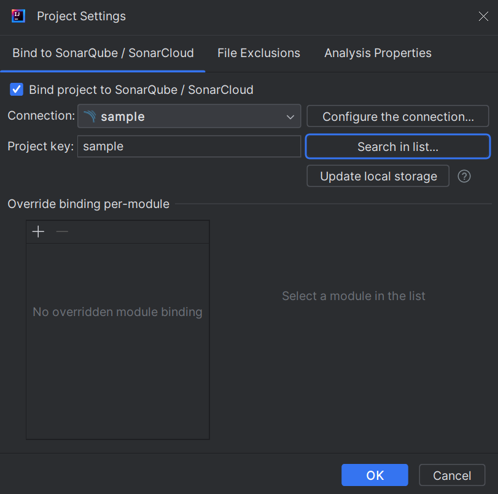
11. 設定が完了すると最後に**SonarLint suggestions**というポップアップが右下にでてくるため、**Configure binding**を選択します 
    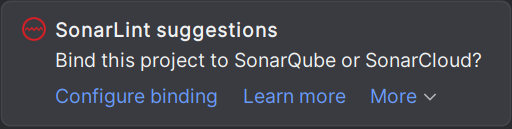

これでSonarQubeとSonarLintがバインディングされ、ローカルでの分析にSonarQubeで定義されたルールや課題が適用されるようになります。

## リアルタイムでスキャンを行う

インストールをしていれば、自動で解析が行われます。

コードのエディタには下図のように指摘箇所が波線で強調表示されるようになります。

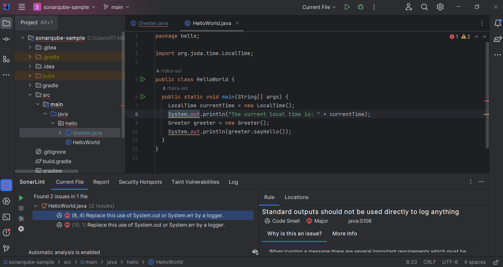

また、アプリケーションの左端にあるプラグインの一覧の中からSonarLintをクリックすると、指摘項目が一覧で表示されます。指摘内容の詳細を確認したい場合は、一覧内のアイテムをクリックすると図のように画面右側に表示されます。

## プロジェクト全体をスキャンする

SonarQubeのようにSonarLintもプロジェクト全体のスキャンが可能です。

次の手順で行うことができます。

1. アプリケーションの左端にあるプラグインの一覧の中からSonarLintをクリックします
2. SonarLint内の上部にあるタブから**Report**をクリックします
3. **Analyze All Project Files**をクリックします 
   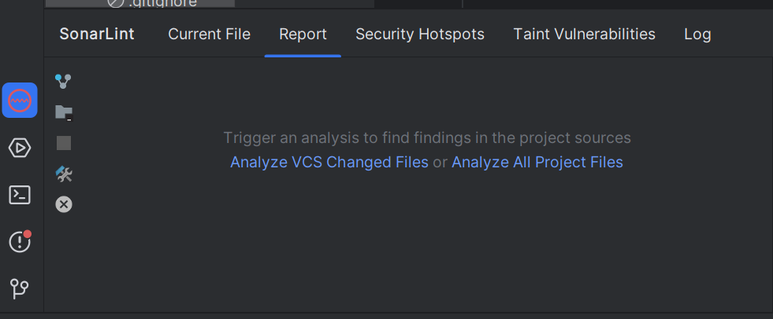
4. スキャンが完了するとその内容が一覧で表示されます 
   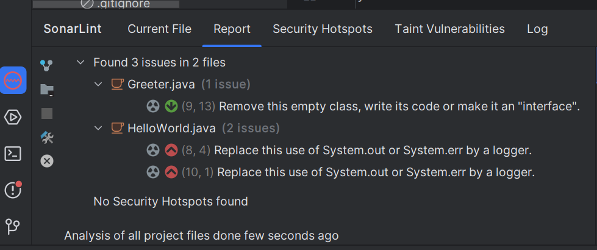 
