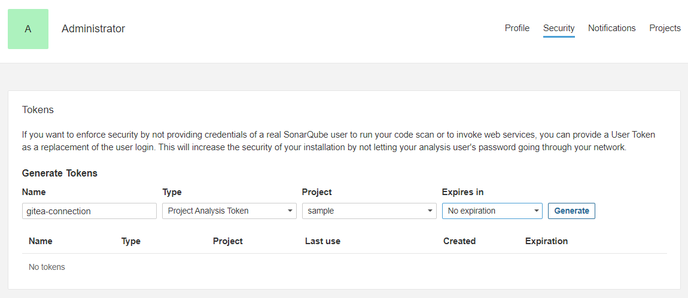

# SonarQubeセットアップ

SonarQubeにプロジェクトを登録し、Giteaにて初回スキャンを行うところまで設定します。

## 前提条件

- Giteaのセットアップ手順が完了している
- Actionsが有効になっており、Actions RunnerがGiteaに登録されている

## プロジェクトの登録

1. `http://host名（or ホストのIPアドレス）:30090`へアクセスします
2. IDとパスワードに`admin`と入力し、ログインします
3. パスワード変更画面が開くので、変更します
4. 下図のようなホーム画面が開くので、もっとも下にある「Manually」と書いてあるものを選択します</br>
   
5. それぞれの項目を入力し、「Set Up」をクリックします</br>
   

入力項目の詳細は次の通りです。

### Project display name

プロジェクト登録後にSonarQubeのホーム画面に表示されるプロジェクト名。

### Project Key

プロジェクトを認識するためのキー。

キーは入力欄下に表示されている制約さえ守られていればどのようなものでも問題ありません。例では「Project display name」と同じにしていますが、まったく違うものでも構いません。

### Main branch name

リポジトリでデフォルトに登録されいるブランチ名。

## Tokenの生成

SonarQubeへアクセスするためのトークンを生成します。

1. 画面右上にあるユーザーアイコンをクリックし、「My Account」というボタンをクリックします</br>
   
2. 上部のタブにある「Security」をクリックします</br>
3. 「Tokens」というトークン登録フォームが表示されるので、それぞれの項目を入力して「Generate」をクリックします</br>
   
   - Name: わかりやすい名前にします
   - Type: `Project Analysis Token`
   - Project: 先ほど登録したプロジェクト名
   - Expires in: チームの方針にしたがって決めてください
4. 表示されたトークンをコピーし、一時的に別の場所に書き写します</br>
   
   **※注意: 一度しか表示されないため、紛失した場合は作成し直すことになります**

## Gitea Actionsのシークレット登録

Gitea Actionsで使用する環境変数を登録します。

1. Giteaのリポジトリ画面を開きます
2. 上に表示されているタブのもっとも右にある、「設定」をクリックします</br>
   
3. 画面左のリスト内を「Actions」、「シークレット」の順でクリックします
4. 「シークレットを追加」というボタンをクリックすると登録フォームが表示されるので、次のものを登録します</br>
   
   | 名称 | 値 |
   | -- | -- |
   | SONARQUBE_TOKEN | 「Tokenの生成」で生成したトークン |
   | SONARQUBE_HOST_URL | `http://sonarqube-svc:9000` |

## Gitea Actionsのワークフロー作成

Giteaに差分をプッシュまたはプルリクエストを作成した際、自動でSonarQubeのスキャンを行うような設定を作ります。

また、もしSonarQubeのQuality gateをクリアしていなければそのワークフローが失敗するような設定にもなります。

Quality gateの詳細については次章を参照してください。

1. リポジトリのルートに階層が`.gitea/workflows/analysis-by-sonar.yaml`となるように、ファイルとフォルダを作成します
2. 作成したYamlファイルに次の内容を書き込みます</br>
   次の内容の詳細は「ワークフローのカスタマイズ」の章で記します
   ```yaml
   name: "sonarqube"
   on: [push, pull_request]

   jobs:
     analysis-with-sonar:
       runs-on: ubuntu-latest
         steps:
            - uses: actions/checkout@v3

            - name: Setup Java 17
              uses: actions/setup-java@v3
              with:
                 distribution: "zulu" 
                 java-version: "17"
                 cache: "gradle"

            - name: Install jq command
              run: |
                 apt -y update
                 apt -y install jq

            - name: Build
              run: bash ./gradlew build

            - name: Scan with SonarQube
              uses: https://github.com/SonarSource/sonarqube-scan-action@master
              env:
                 SONAR_TOKEN: ${{ secrets.SONARQUBE_TOKEN }}
                 SONAR_HOST_URL: ${{ secrets.SONARQUBE_HOST_URL }}

            - name: Make sure pass the Quality Gates
              uses: https://github.com/SonarSource/sonarqube-quality-gate-action@master
              timeout-minutes: 5
              env:
                 SONAR_TOKEN: ${{ secrets.SONARQUBE_TOKEN }}
                 SONAR_HOST_URL: ${{ secrets.SONARQUBE_HOST_URL }}
   ```
3. リポジトリのルートに`sonar-project.properties`というファイルを作成します
4. 作成したファイルに次の内容を書き込みます
   ```properties
   sonar.projectKey=プロジェクトキー

   sonar.java.binaries=build/**/*
   ```
   `sonar.projectKey`は`SonarQubeセットアップ > プロジェクトの登録`にてSonarQubeに登録したプロジェクトキーを入力してください
5. 上記の内容をコミット＆プッシュします
6. Giteaの「Actions」というタブを開くと、ワークフローの実行状況及び結果を確認することができます</br>
   
7. SonarQubeを開くと下図のように登録したプロジェクトが表示されるので、プロジェクト名をクリックするとスキャン結果を確認できます</br>
   

## Quality gateの設定

Quality gateとはプロジェクトのコードがクリアすべき品質の基準を示すものです。

これはSonarQube内でプロジェクトごとに自由に定義することができます。

前章のSonarQubeの実行結果ではプロジェクト名の横に緑色で「Passed」と表示されていましたが、これはQuality gateをクリアしているというステータス表示です。

もしクリアしていない場合は、赤色で「Failed」と表示されます。

Quality gateは初期値として、デフォルト値が設定されていますが、カスタマイズしたい場合は次の手順で行うことができます。

1. SonarQubeを開き、画面上部のタブにある「Quality Gates」をクリックします</br>
   
2. 画面に初期値で表示される「Sonar way `DEFAULT` `BUILT-IN`」とあるのがデフォルトで設定されているQuality gateです</br>
   画面左にある「Create」をクリックすると、新たにQuality gateを追加できます</br>
   
3. 「Conditions」という項目で自由に基準を変えることができます</br>
   
4. 設定完了後、前章でスキャンしたプロジェクトのスキャン結果のページを開きます
5. 「Project Settings」のプルダウンメニューをクリックし、さらにメニュー内の「Quality Gate」をクリックします</br>
   
6. 「Always use a specific Quality Gate」を選択し、使用する設定に先ほど作成したQuality gateを選択し、「Save」をクリックします</br>
   

次回スキャン時から新たに設定したQuality gateが適用されます。

なお、公式ドキュメントのページは次になります。

[Quality gates](https://docs.sonarsource.com/sonarqube/latest/user-guide/quality-gates/)

## ワークフローのカスタマイズ

Gitea ActionsはGitHub Actionsと互換性があり、GitHub Actionsと同様の構文で記述することができます。

そのため、公式のドキュメントとしてここでは[GitHub Actions](https://docs.github.com/en/actions/quickstart)を挙げます。

なお相違点が一部あり、Gitea公式の「[Compared to GitHub Actions](https://docs.gitea.com/next/usage/actions/comparison)」にその項目が記されています。

詳しくカスタマイズ、もしくはまったく新しいワークフローの作成をしたい場合は参照してください。

### ワークフローの説明

本手順書で示したワークフローはどのような処理を行っているのかは、次の「ワークフローの説明」で示します。

```yaml
# このワークフローの名前
name: "sonarqube"
# Giteaへの「Push」時と、「Pull Request」を作成したタイミングでこのワークフローが動きます
# トリガーにできるイベントは[Triggering a workflow](https://docs.github.com/en/actions/using-workflows/triggering-a-workflow)に示されています
on: [push, pull_request]

jobs:
   # ジョブ名
   analysis-with-sonar:
      runs-on: ubuntu-latest
      steps:
         # 「uses」で公式または有志が公開しているActionsのスクリプトを使用することができます
         # GitHubに公開されているスクリプトを使用したい場合は、「Scan with SonarQube」で使用しているように
         # フルパスでリポジトリを指定します
         # フルパスではない場合、Gitea公式のデフォルトのリポジトリが選択されます
         # なお、Gitea公式のスクリプトがあるリポジトリは次になります。
         # https://gitea.com/actions
         - uses: actions/checkout@v3

         # Javaのセットアップを行います
         - name: Setup Java 17
            uses: actions/setup-java@v3
            with:
               distribution: "zulu" 
               java-version: "17"
               cache: "gradle"

         # 「Scan with SonarQube」を実行する際、jqコマンドが必要になるためインストールします
         - name: Install jq command
            run: |
               apt -y update
               apt -y install jq

         # 「Scan with SonarQube」を実行する際にコンパイル結果が必要であるため、ビルドします
         - name: Build
            run: bash ./gradlew build

         # SonarQubeでScanを行うためのアクションです
         - name: Scan with SonarQube
            uses: https://github.com/SonarSource/sonarqube-scan-action@master
            env:
               SONAR_TOKEN: ${{ secrets.SONARQUBE_TOKEN }}
               SONAR_HOST_URL: ${{ secrets.SONARQUBE_HOST_URL }}

         # 「Scan with SonarQube」でスキャンを行った結果から、Quality gateをクリアしているか確認するアクションです
         # クリアしていない場合、このアクションが失敗し、ワークフロー全体が失敗になります
         - name: Make sure pass the Quality Gates
            uses: https://github.com/SonarSource/sonarqube-quality-gate-action@master
            timeout-minutes: 5
            env:
               SONAR_TOKEN: ${{ secrets.SONARQUBE_TOKEN }}
               SONAR_HOST_URL: ${{ secrets.SONARQUBE_HOST_URL }}
```

### ワークフローの編集

本手順書で示しているSonarQubeでスキャンを自動で行うワークフローは、次の2つが満たされていれば基本的にはどの言語でも実行可能です。

ただし、SonarQubeがスキャン可能である言語に限ります。

1. ワークフローを実行するマシンに言語の実行環境が存在する
2. コンパイル（ビルド）結果が存在する

例で示しているワークフローではそれぞれ次の名前のステップが該当します。

1. Setup Java 17
2. Build

そのため、たとえNode.jsを使用しているプロジェクトの場合、次のように変更を加えると動作可能になります。

1. Setup Java 17に該当する箇所
   ```yaml
   - uses: actions/setup-node@v3
     with:
       node-version: 18
       cache: 'npm'
   ```
2. Buildに該当する箇所
   ```yaml
   - name: Build
     # ビルドスクリプトが`npm build`の場合
     run: |
       npm install
       npm build
   ```

なお、`sonar-project.properties`も変更する必要があります。

`sonar.projectKey`はプロジェクトごとに違うため、変更は必須です。

`sonar.java.binaries`はコードのコンパイル結果のディレクトリを指定するものであり、必要ない場合もあります。

一度ファイルから削除してからワークフローを実行し、失敗した場合はエラーログにしたがって加筆するようにしてください。
