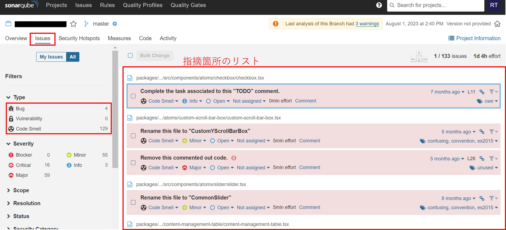
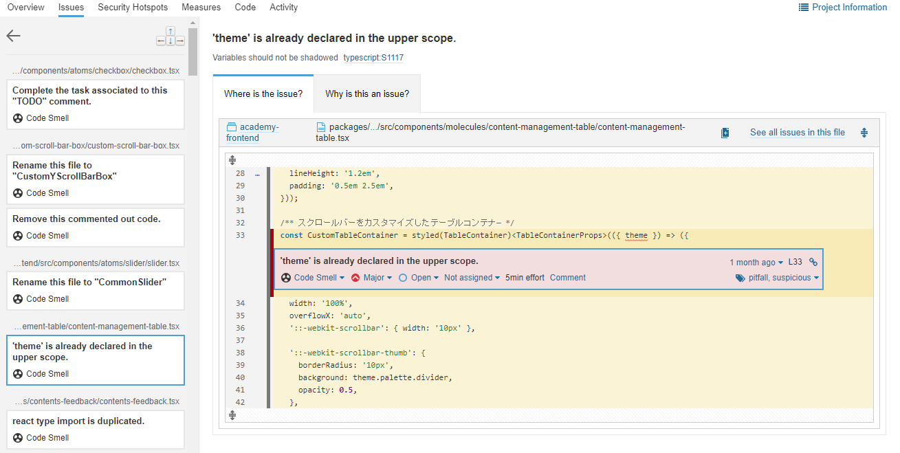

# SonarQube運用方法

## 前提条件

- SonarQubeのセットアップ手順が完了している

## スキャンを行うタイミング

`.gitea/workflows/analysis-by-sonar.yml`の2行目の`on`の内容によってスキャンを行うタイミングが異なります。

```yaml
name: "sonarqube"
on: [push] # ここです

jobs:
  analysis-with-sonar:
    runs-on: ubuntu-latest
    steps:
      - uses: actions/checkout@v3
```

上記の例ではリポジトリにプッシュを行ったタイミングでワークフローが実行され、SonarQubeによるスキャンがかかります。

他にも例を挙げると、`pull_request`となっている場合は、プルリクエスト作成時及びプルリクエストがある状態でそのブランチにプッシュを行った時にスキャンされます。

## スキャン結果の確認

スキャン結果は`http://host名（or ホストのIPアドレス）:30090`へアクセスすると確認できます。

ワークフローがFailedした場合は必ず確認し、どのような項目で品質が悪いとされているのかを見てください。

例として、スキャンした結果、Quality gateをクリアしておらずステータスがFailedとなっているとします。

まず、プロジェクトのスキャン結果の「Issue」を開くと下図のような画面が表示されます。

画面左側のリストでは「Bug」、「Vulnerability」、「Code Smell」の3つに指摘項目が分類されており、右側のリストではその指摘理由のタイトルが表示されます。



また、右側のリストに表示されているタイトルをクリックすると、下図のようにさらに詳しく指摘箇所と指摘理由を確認することができます。



さらに、もしセキュリティホールとなるコードが存在した場合は画面上部のタブの「Security Hotspots」を開くと、詳しい内容を確認できます。
