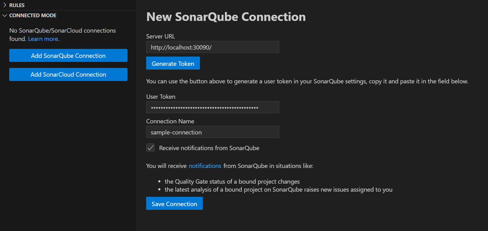
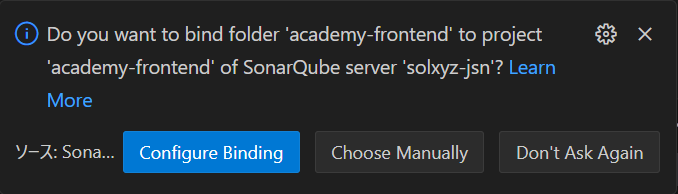
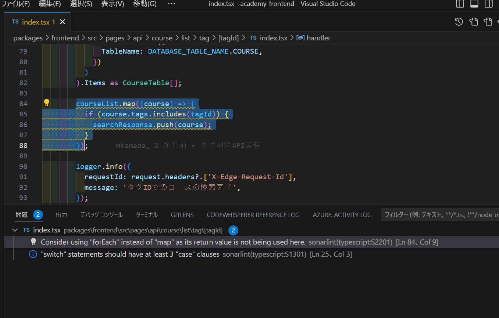
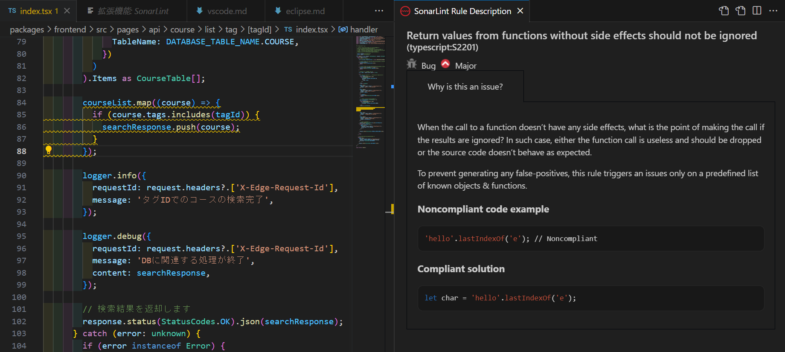

# VS CodeでSonarLintを使用する

## SonarLint設定手順

### マーケットプレイスからインストールする

以下のリンクから拡張機能をインストールします。

[SonarLint](https://marketplace.visualstudio.com/items?itemName=SonarSource.sonarlint-vscode)

### オンラインのSonarQubeと同期する

設定が必須ではないですが、オンライン同期には以下のような利点があります。

- **共有されたルール**: SonarQubeに定義されたカスタムルールがEclipse内のSonarLintプラグインで適用されます。これにより、チームメンバー間で一貫したコーディング規約を維持することができます。
- **False Positive (誤検出) の管理**: SonarQube上でFalse PositiveやWon't Fixとしてマークされた問題は、SonarLintでも同期され、マーカー表示されなくなります。これにより、既知の誤検出や対応の予定がない問題に対して再度注意を払わなくても済むようになります。
- **課題の同期**: SonarQubeで検出された課題がSonarLintに同期され、開発者がローカルで編集中に課題を確認・修正できるようになります。これにより、問題の修正が容易になります。

以下に設定手順を示します。

1. SonarLintの拡張機能を開きます
2. **Connected Mode**から**Connect to SonarQube**をクリックします
3. コネクションの入力画面が表示されるので、必要項目を入力し、**Save Connection**をクリックします 
   
4. 接続に成功するとSonarQubeのプロジェクトとバインドするか選択するポップアップが表示されるので、**Configure Binding**をクリックします 
   

これでSonarQubeとSonarLintがバインディングされ、ローカルでの分析にSonarQubeで定義されたルールや課題が適用されるようになります。

## リアルタイムでスキャンを行う

インストールが完了すると、自動で解析が行われ、コードを編集すると下図のように指摘箇所が強調表示されるようになります。

また、波線左側に表示されている電球マークをクリックすると、指摘理由となるルールの詳細説明を見ることができます。

