# Checkstyleの使い方

本ドキュメントでは、Checkstyleの使い方について解説します。

## 導入

EclipseのCheckstyleプラグインを導入します。

ヘルプ > Eclipseマーケットプレイスから`Checkstyle プラグイン xx.xx.xx`（xはバージョン）をインストールします。

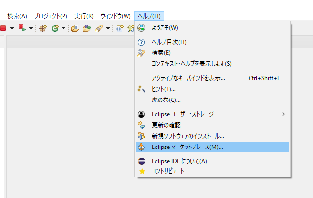

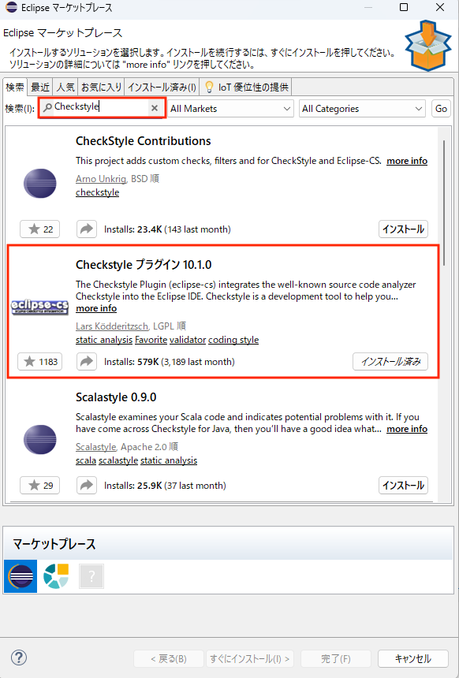

インストール後、再起動したらCheckstyleが使えます。

## 設定

ソルクシーズスタンダードのCheckstyle設定ファイルを読み込みます。

まず、[checkstyle.xml](./checkstyle.xml)をダウンロードし、任意の場所に配置します。

次に、`checkstyle.xml`を読み込みます。`ウィンドウ > 設定 > Checkstyle`から、`新規`を開きます。

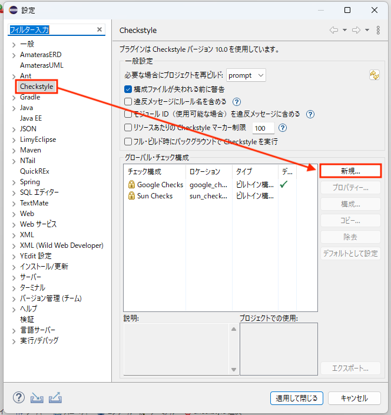

ここで設定ファイルをインポートします。次の内容を入力します。

|項目|入力値|
|--|--|
|タイプ|内部構成|
|名前|任意の名前（ここでは`solxyz-standard`）|

さらに、`インポート`をクリックし、`checkstyle.xml`を選択します。

上記を入力したら、`OK`をクリックします。

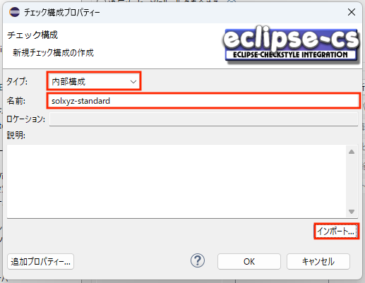

`グローバル・チェック構成`に`solxyz-standard`が追加されました。

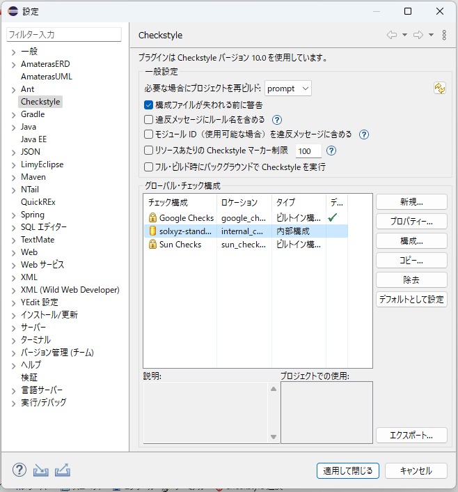

次に、インポートした設定をプロジェクトに適用します。`プロジェクトを右クリック > プロパティ > Checkstyle`を開きます。

`シンプル構成を使用する`のチェックを外し、`このプロジェクトでCheckstyleをアクティブにする`のチェックを入れます。

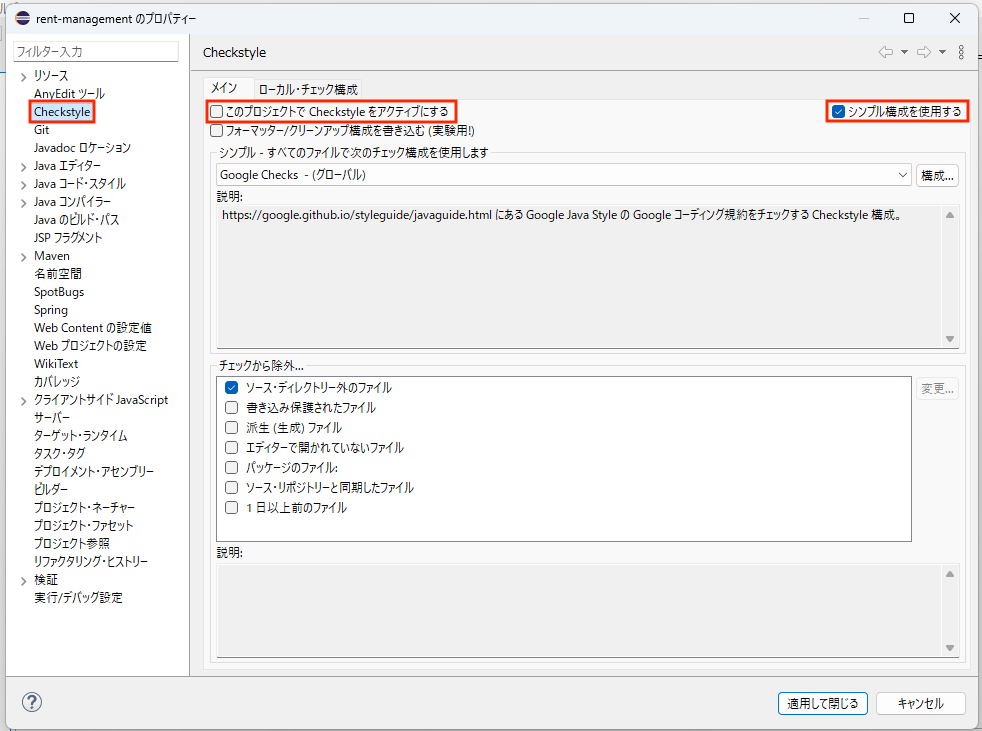

デフォルトのCheckstyle設定である`Google Checks`を`除去`し、`追加`をクリックします。

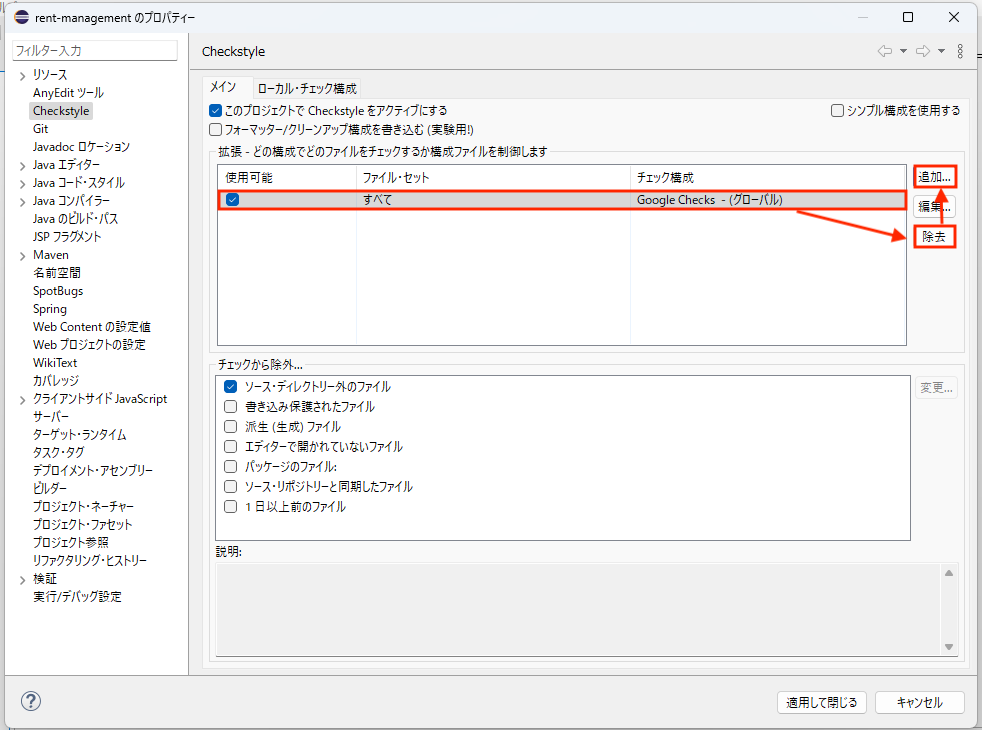

`ファイル・セット名`に任意の名前（ここでは`solxyz-standard`）を入力し、`チェック構成`で、先ほどインポートした`solxyz-standard`を選択し、`OK`をクリックします。

`solxyz-standard`が追加されました。

`適用して閉じる`をクリックします。

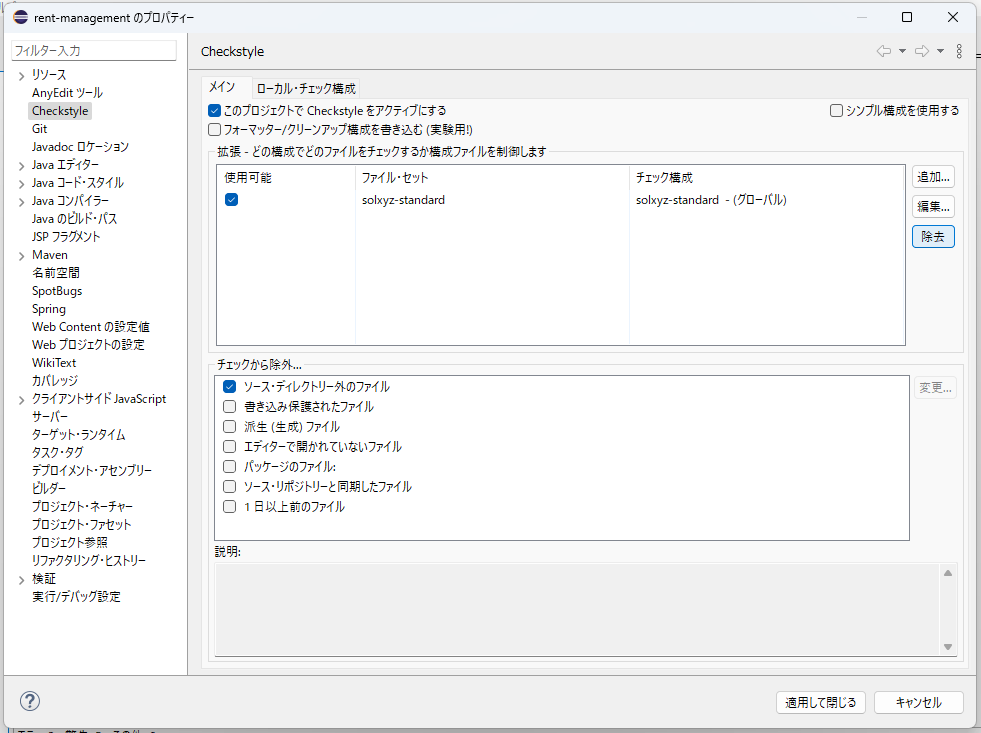

## 実行

Checkstyleを実行します。

`プロジェクトを右クリック > Checkstyle > Checkstyleでコードチェック`を選択します。

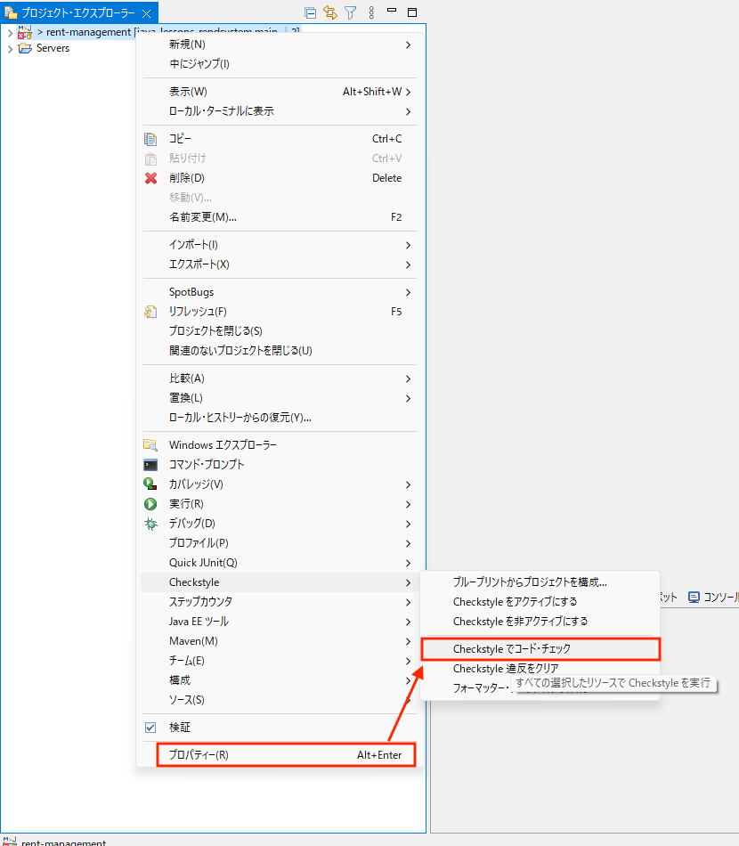

次に、Checkstyleのエラー確認用の**ビュー**を開きます。

`ウィンドウ > ビューの表示 > その他 > Checkstyle > Checkstyle違反`を選択し、OKを押下します。

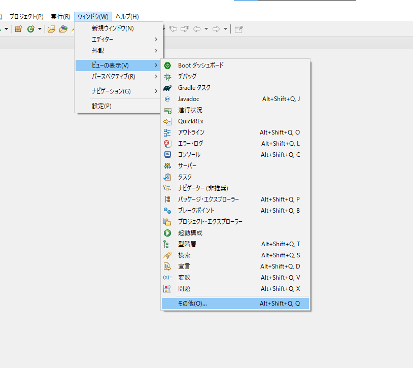
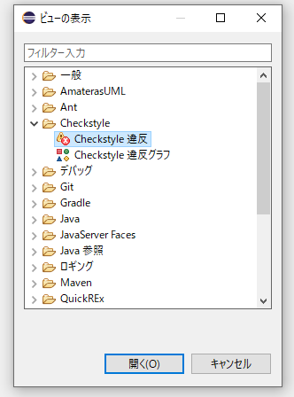

`Checkstyle違反`のタブが表示され、ルールに違反している箇所が一覧表示されます。

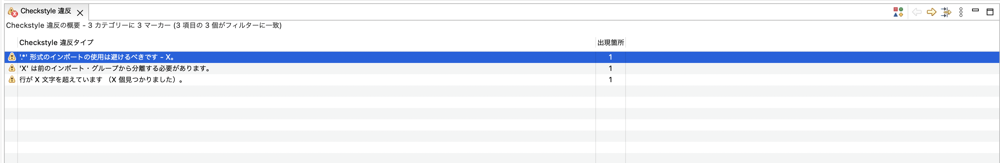

違反をダブルクリックすると、該当箇所一覧が表示されます。

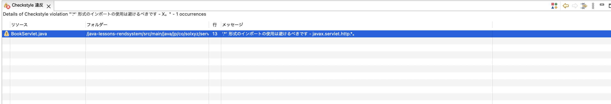

さらに該当箇所をダブルクリックすると、ソースコードが表示されます。ソースコード上では、次のように違反箇所が黄色く表示されます。

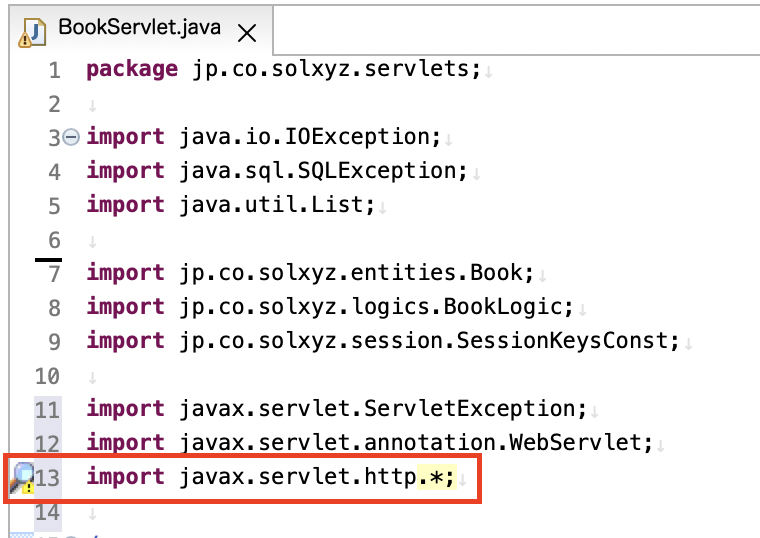

なお、修正（保存）するとCheckstyle違反は自動的に更新されます。

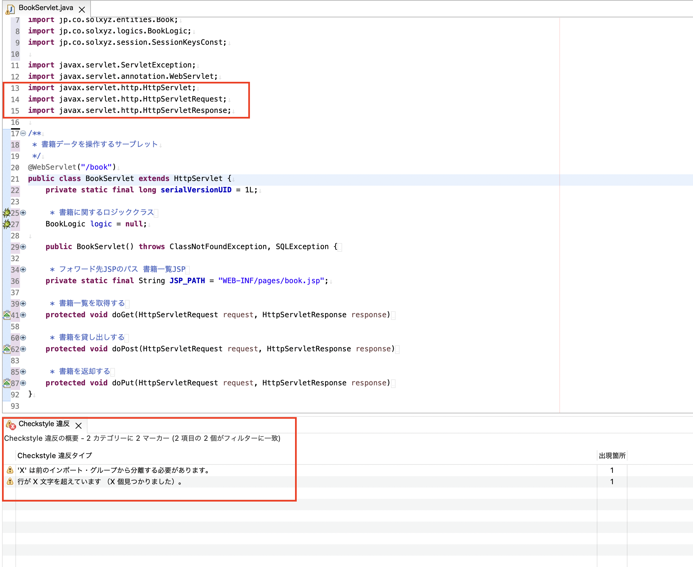

ワイルドカードインポートを削除し、それぞれのクラスをインポートしました。

`'*'形式のインポートの使用は避けるべきです`というCheckstyle違反が消えたことが確認できます。