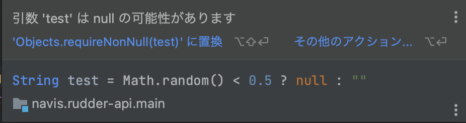

# 7. 付録

- [7. 付録](#7-付録)
  - [7.1. `Lombok`を利用して生産性を上げる](#71-lombokを利用して生産性を上げる)
    - [7.1.1. Getter・Setterを削除する](#711-gettersetterを削除する)
  - [7.2. 引数にnullを許容しないことで`NullPointerException`を防ぐ](#72-引数にnullを許容しないことでnullpointerexceptionを防ぐ)
  - [7.3. 変数の型で`NullPointerException`を防ぐ](#73-変数の型でnullpointerexceptionを防ぐ)

## 7.1. `Lombok`を利用して生産性を上げる

Javaを組んだことのある人であれば、GetterやSetterなどをEclipseの機能を利用して自動生成したことがあると思います。

しかし、メンバー変数を更新すると自動生成し直さなければなりません。

この問題を解消するライブラリが`Lombok`です。

`Lombok`はMITライセンスのため無料で商用利用ができます。

`Lombok`はJavaを書く上でのデファクトスタンダードなライブラリです。
Spring Bootなどでも使用されています。

### 7.1.1. Getter・Setterを削除する

次のソースコードを見てみましょう。

```java
public class Hoge {
    private String fuga;
    private int value;

    public void setFuga(String fuga) {
        this.fuga = fuga;
    }

    public String getFuga() {
        return this.fuga;
    }

    public void setValue(int value) {
        this.value = value;
    }

    public int getValue() {
        return this.value;
    }
}
```

このとき、変数`fuga`を`fugafuga`に変更した場合、メソッドの自動生成を再度行う必要があります。

Getter・Setterは本質的なことではないため、少しばかり手間がかかり開発者は煩わしさを感じるでしょう。

それでは`Lombok`で書き直すとどのようになるでしょうか。

```java
@Getter
@Setter
public class Hoge {
    private String fuga;
    private int value;
}
```

`Lombok`ではビルド時にアノテーションの情報を元にソースコードを自動生成します。

そのため、開発者の手で生成する必要がなくなります。

## 7.2. 引数にnullを許容しないことで`NullPointerException`を防ぐ

`NullPointerException`を防ぐ際に次のようなソースコードを書くことが多いかと思います。

```java
public void hoge(String arg1) {
    if (arg1 == null) {
       // 処理中断
    }
    ...
}
```

しかし、引数の時点で`null`を許可しなければこのようなソースコードを書く必要は無くなります。

そこで登場するのが`@NonNull`というアノテーションです。

`@NonNull`アノテーションは`Lombok`に含まれています。

実際に`null`が渡されるとメソッドがNullPointerExceptionを発生させます。

また次のようなコードを記載した際に、`IntelliJ IDEA Community Edition`では「`null`を渡す可能性がある」と警告するため、開発者の`null`に対する意識向上につながるでしょう。

残念ながら`Eclipse`では同様の警告の機能は存在しません。

```java
public void getHoge() {
    String test = Math.random() < 0.5 ? null : "";
    getFuge(test); //実際にnullが渡るとNullPointerException発生
}

private void getFuge(@NonNull String test) {
    System.out.println(test);
}
```



この警告は既存ソースコードを大幅に変えなくても出すことができるため、リファクタリング時に追加してあげるなどして、考慮されていない`NullPointerException`を防ぎましょう。

## 7.3. 変数の型で`NullPointerException`を防ぐ

Java 8から追加された型に`Optional`という型があります。

こちらは`null`になる可能性があることを呼び出し元に知らせるための型です。

実際の使い方を見てみましょう。

次の例では、DBに問い合わせを行いその結果をreturnしています。DBは検索条件に合致するレコードが存在しない場合があります。その場合はJavaでは`null`が結果としてreturnされます。

```java
public void getHoge() {
    TableData result = getTableData(1); //nullの可能性があることは実装者に判断が委ねられる
}


public TableData getTableData(final int userId) {
    //DBに問い合わせ
    return query.select(userId);
}
```

このメソッドを利用した呼び出し元に`null`の可能性を伝えるにはどうしたらよいでしょうか？

このひとつの解答が[Optional型](https://docs.oracle.com/javase/jp/8/docs/api/java/util/Optional.html)です。

`Optional`とは「`null`かもしれない」ことを表す型です。

次の例は`hoge`というString型の変数は`null`の可能性があることを意味します。

```java
Optional<String> hoge;
```

この型を利用することで先ほどのソースコードが次のようになります。

```java
public void getHoge() {
    Optional<TableData> result = getTableData(1); //nullの可能性があることは実装者に判断が委ねられる
    //resultを使いたい場合Optionalから値を取り出す必要がある
    result.ifPresent(
        tableData -> {
            //resultの値がnullではない場合のみ実行する
            ...
            //これによりNullPointerExceptionを防ぐ
        }
    );

    //nullの場合の処理も書きたい場合
    result.ifPresentOrElse(
        tableData -> {
            //resultの値がnullではない場合に実行する
            ...
        }, () -> {
            //resultの値がnullの場合に実行する
            ...
        }
    );
}


public Optinal<TableData> getTableData(final int userId) {
    //DBに問い合わせをしています
    return Optinal.ofNullable(query.select(userId));
}
```

`getTableData`のように`null`が返却される可能性のあるメソッドには`Optional`型でラップすることで、`null`判定を強制することができます。

`Optional`型でラップしない戻り値は確実に`null`ではないことをそのメソッド実装者が保証します。

保証できない場合は、`Optional`型でラップするとよいでしょう。

これにより、`NullPointerException`を防ぐことができます。
