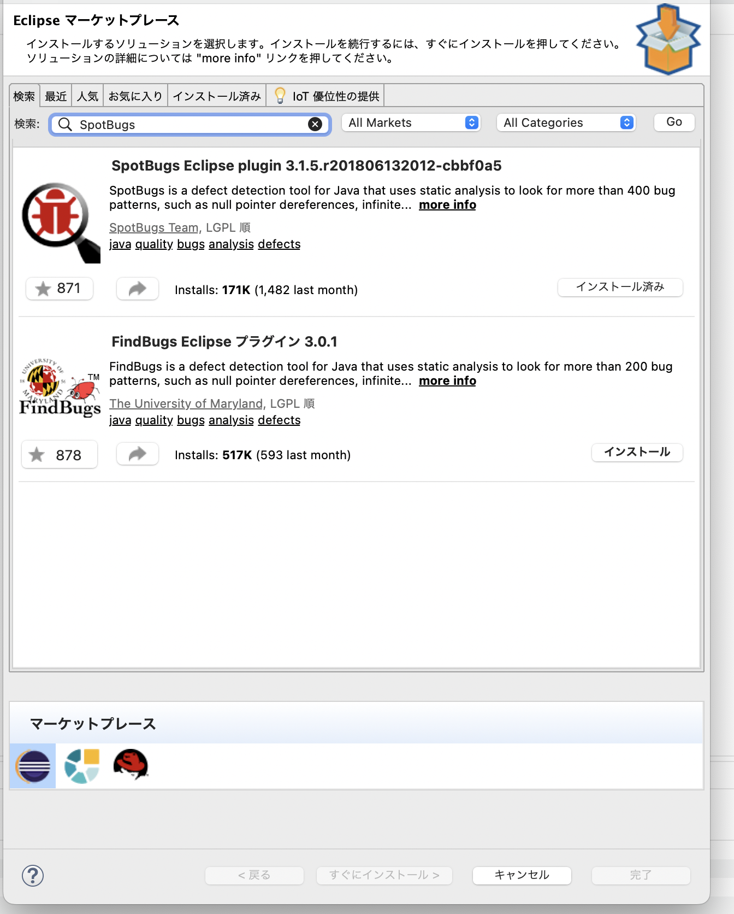
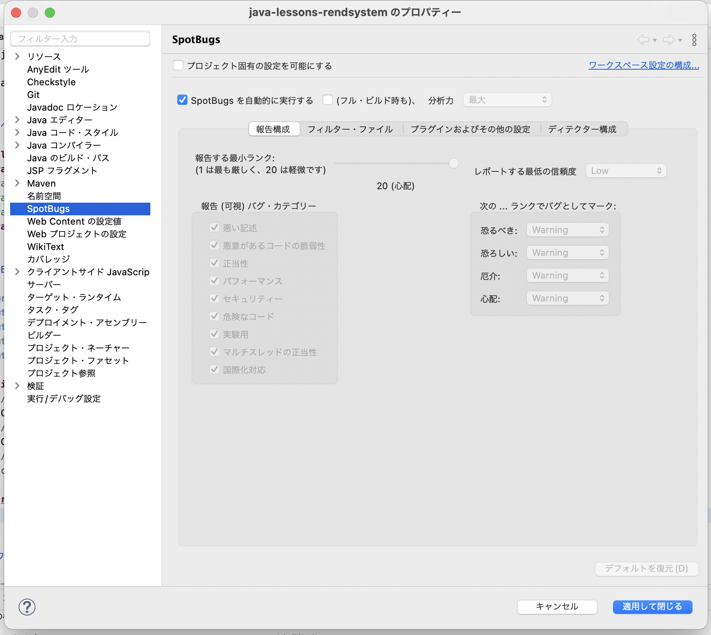
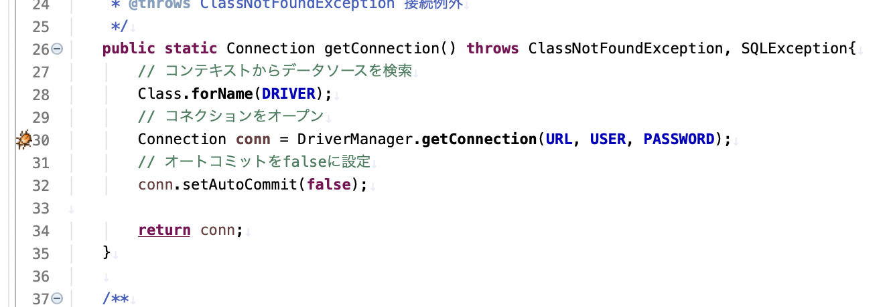
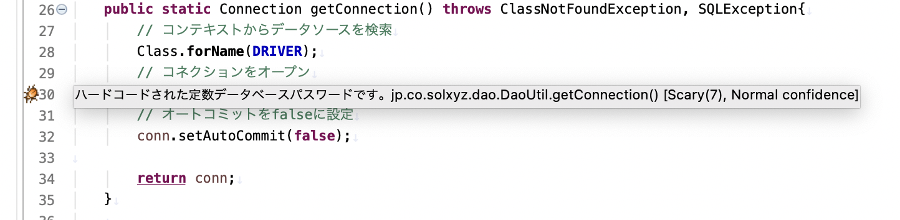
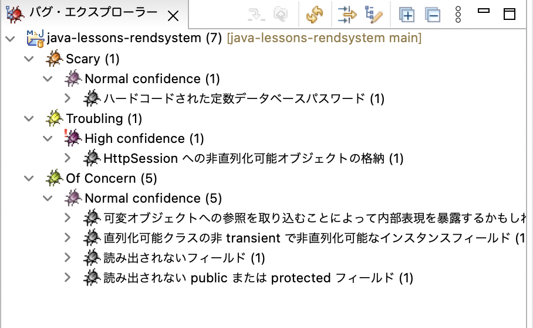
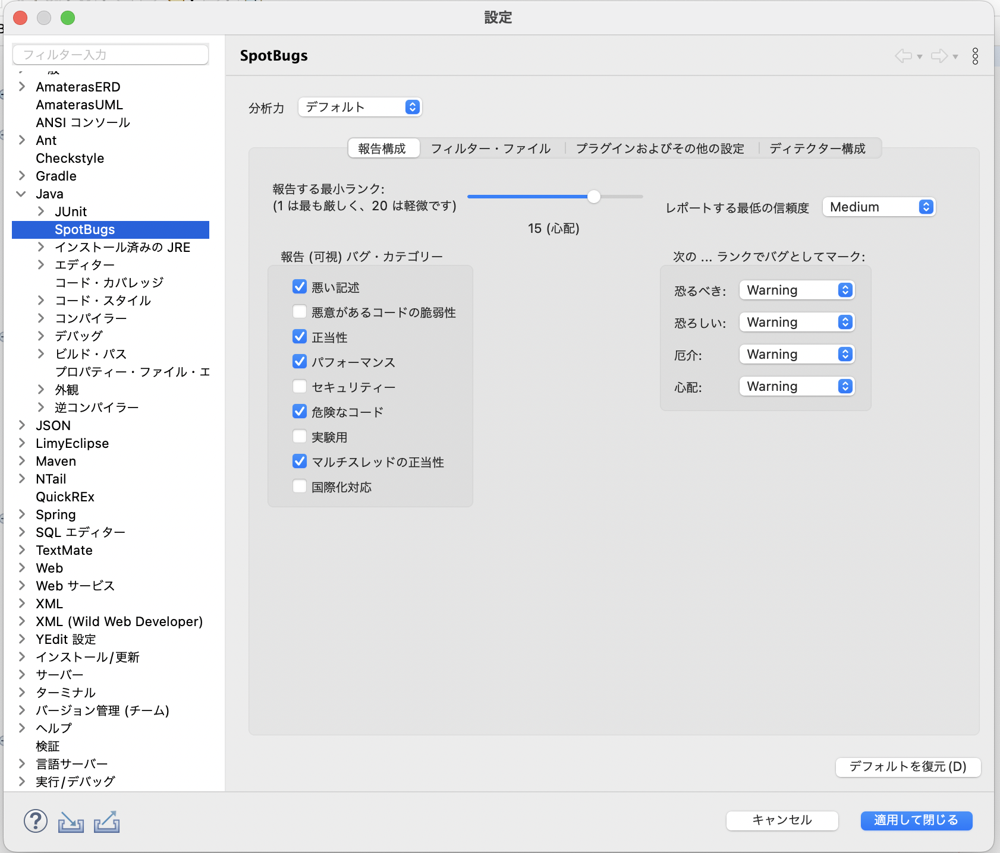
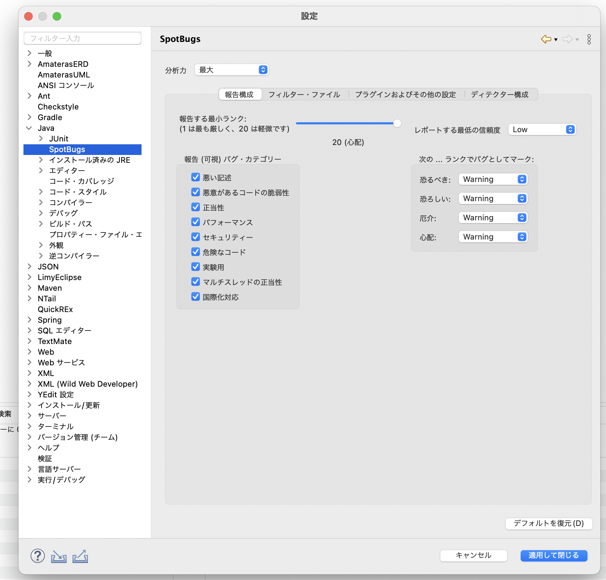

# SpotBugs利用手引き

## SpotBugsとは

SpotBugsは、Javaプログラムの中の潜在的なバグをみつける静的解析ツールです。

400以上のバグパターンを持っていて、パターンに合致するコードをマークします。

SpotBugsでは、このマークされたコードを**バグ**と呼称しています。一般的な処理の誤りを意味するバグと混同しないようにご注意ください。

[SpotBugsマニュアル](https://spotbugs.readthedocs.io/ja/latest/)

## SpotBugsをインストールする

[SpotBugs Eclipseプラグイン](https://spotbugs.readthedocs.io/ja/latest/eclipse.html)を使用します。

ソルクシーズスタンダード開発標準パッケージ、および[Pleiades](https://mergedoc.osdn.jp/)ではデフォルトでインストールされています。

インストールされていない場合は、マーケットプレイスからインストールします。

## SpotBugsを使用する

`プロジェクトを右クリック > プロパティ > SpotBugs > SpotBugsを自動的に実行する`にチェックを入れることで、SpotBugsを有効化します。これにより、ソースコードの保存時にSpotBugsが自動実行され、バグが検出されます。

※マシンのパフォーマンス等の理由で自動実行ができない場合、上記チェックは外してください。代わりに、`プロジェクトを右クリック > SpotBugs > バグを検索`で手動実行できます。

検出されるバグのレベルは次の4段階です。上に行くほど重大なエラーを引き起こす可能性があります。

- `Scariest（恐るべき）`
- `Scary（恐ろしい）`
- `Troubling（厄介）`
- `Of Concern（心配）`

`SpotBugs`を実行すると、次のようにバグのある行に虫のアイコンが表示されます。

虫のアイコンにカーソルを当てると、バグの内容が表示されます。

`SpotBugs`パースペクティブを使うとプロジェクトに存在するバグを一覧で確認できます。

## SpotBugsの設定

`SpotBugs`に関する設定は、`ウィンドウ > 設定 > Java > SpotBugs`から変更できます。

ソルクシーズスタンダードでは、エラーを引き起こすような記述をしないことを目的とし、設定項目を**もっとも厳しい**値とすることを推奨します。次のように設定します。

|設定項目|設定値|
|--|--|
|分析力|最大|
|報告する最小ランク|20|
|報告（可視）バグ・カテゴリー|すべてにチェックを入れる|
|レポートする最低の信頼度|Low|

上記設定後の画面は次のとおりです。

※設定が厳しすぎる場合、プロジェクトの方針にしたがって適切にカスタマイズしてください。

以下、各設定項目の意味を解説します。

### 分析力

[公式リファレンス](https://spotbugs.readthedocs.io/ja/latest/effort.html)では「解析力」と翻訳されています。

この項目は、バグ解析の精度を設定します。

`最大`にすると精度が高くなりますが、解析時間が長くなります。

`最小`にすると精度が低くなりますが、解析時間が短くなります。

### 報告する最小ランク

1-20の範囲で値を設定します。

値が高いほど、軽微なバグでも報告されるようになります。

### レポートする最低の信頼度

次の3つから選択します。

- `Low`
- `Medium`
- `High`

この項目は、レポートに含むバグの閾値を、バグの可能性という観点から設定します。

`Low`に設定すると、バグの可能性が低いものでも検知されます。

`High`に設定すると、バグの可能性が高いもののみ検知されます。

### 報告（可視）バグ・カテゴリー

レポートに含むバグのカテゴリーを選択します。

### 次のランクでバグとしてマーク

バグの各レベルの出力ランクを設定します。

バグ検出には関わりませんが、`Scariest（恐るべき）`と`Scary（恐ろしい）`は`Error`で表示、それ以下は`Warning`で表示といった使い方が可能です。

## SpotBugsが検知可能なバグ

[検知可能なバグ](https://spotbugs.readthedocs.io/ja/latest/bugDescriptions.html)が公開されています。

バグは、10のカテゴリに分かれており、合計で468種類あります。（2022年10月時点）
