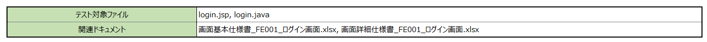
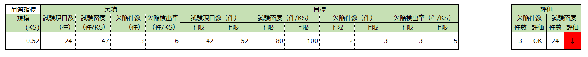
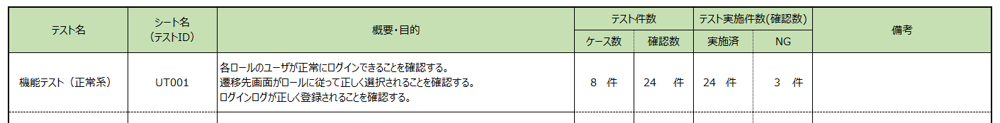
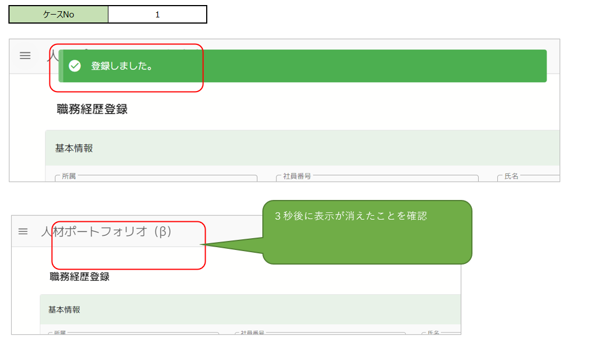
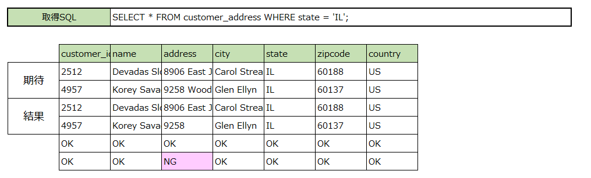
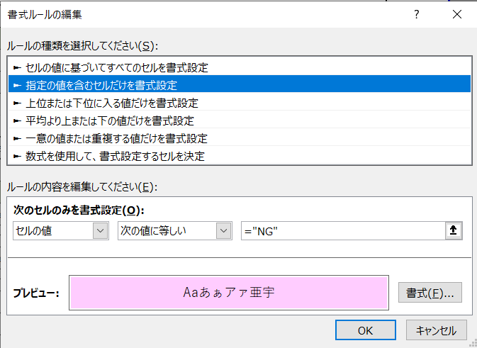
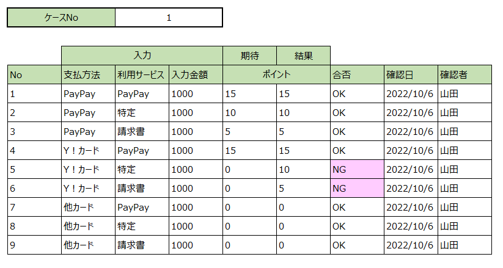
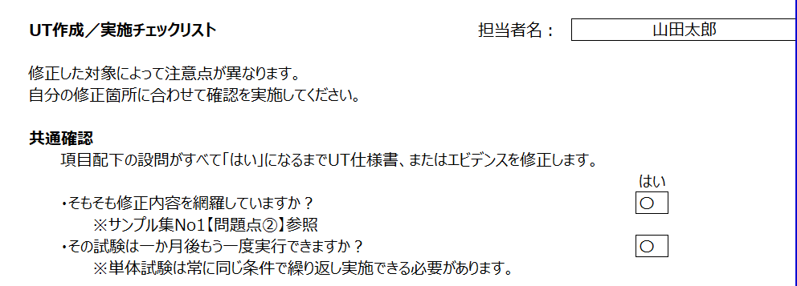

# 単体試験仕様書作成ガイド

本書では単体テスト実施時に利用する単体試験仕様書の記載方法を説明します。

作成にコストはかかりますが、一度作成すれば継続してプロジェクトに貢献します。

新規作成時に基本を抑えて正しく作成しておくことが肝要です。

- [単体試験仕様書作成ガイド](#単体試験仕様書作成ガイド)
  - [ケース一覧（トップシート）](#ケース一覧トップシート)
    - [基本情報](#基本情報)
    - [テスト対象ファイル／関連ドキュメント](#テスト対象ファイル関連ドキュメント)
    - [品質指標](#品質指標)
    - [テスト一覧](#テスト一覧)
  - [テストケース](#テストケース)
  - [テストデータ](#テストデータ)
  - [エビデンス](#エビデンス)
    - [キャプチャ](#キャプチャ)
    - [データベースダンプ](#データベースダンプ)
      - [条件付き書式の例](#条件付き書式の例)
  - [マトリクス](#マトリクス)
  - [チェックリスト](#チェックリスト)

## ケース一覧（トップシート）

ケース一覧では次のような情報を管理します。

- 基本情報
- テスト対象ファイル／関連ドキュメント
- 品質指標
- テスト一覧

### 基本情報

対象とするプログラムの情報、作成情報を記入します。

- プログラムID／プログラム名
  
  プロジェクトで管理しているプログラムID／プログラム名を記入します。
  
  通常は画面単位、または機能単位となります。

- 作成者／承認者

  作成者と承認者を記入します。

  承認者は通常、レビューを担当した上位職になります。

- 作成日／更新日

  文書の鮮度を示すために作成日／更新日を記入します。

  更新日には`=TODAY()`などの関数を導入して保存時に更新することも可能です。

  ただしSVNのようなリポジトリ管理をしていない場合は保存するだけで更新されてしまうため、利用には注意が必要です。

### テスト対象ファイル／関連ドキュメント

テスト対象プログラムファイルと関連する設計書を記入します。

- テスト対象ファイル
  
  テストの対象となるプログラムファイルを明示します。

  レビュアーが品質指標となる規模を確認するために利用します。

- 関連ドキュメント

  設計書などの関連ドキュメントを記入します。

  ドキュメントを明示することでレビュアーはテストケースの妥当性を確認できます。

### 品質指標

品質に関する情報を記入します。

- 規模

  テスト対象ファイルの規模を`ks`（キロステップ）で記入します。

  実績と目標の基準になる数値ですので、正確に記入する必要があります。

  ステップカウントツールを導入し、プロジェクト全体で管理することをお勧めします。

- 実績

  テストの実績を表示します。

  計算式が導入されているので、編集は行いません。

  - 試験項目数

    テスト一覧のテスト件数（確認数）をカウントします。

  - 試験密度

    キロステップあたりのテスト件数を計算します。

  - 欠陥件数

    テスト実施件数（確認数）- NGをカウントします。

  - 欠陥検出率

    キロステップあたりの欠陥数を計算します。

- 目標

  プロジェクトで設定した「試験密度」「欠陥検出率」を入力します。

  「試験項目数」「欠陥件数」は規模と設定した指標との乗算で決定します。

  - 試験項目数

    試験密度＊規模を計算します。

    表示された試験項目数を目指してテストケースを作成します。

  - 試験密度

    試験密度の計算方法はプロジェクトごとに異なります。

    プロジェクト管理者から指示された値を入力します。

  - 欠陥件数

    欠陥検出率＊規模を計算します。

    表示された欠陥件数を目指してテストケースを作成します。

  - 欠陥検出率

    欠陥検出率の計算方法はプロジェクトごとに異なります。

    プロジェクト管理者から指示された値を入力します。
  
- 評価

  実績、目標を基に計算し、テストケースの評価が表示されます。

  指標の範囲から外れている場合は評価欄が赤くなります。

  上下どちらに判定されても**何かしらの問題**を含んでいる可能性があります。

  プロジェクト管理者に相談し、問題解決を行います。

  - 試験密度

    「実績 - 試験項目数」が「目標 - 試験項目数」の範囲にあるかを検証します。

  - 欠陥件数

    「実績 - 欠陥件数」が「目標 - 欠陥件数」の範囲にあるかを検証します。

### テスト一覧

テストの範囲毎にテストケースを分割して定義します。

どのシートにどのようなテストケースが含まれているかを記載します。

例では「機能テスト（正常系）」のように、大雑把な分割をしていますが、

共通のテストデータを利用する確認毎にシートを作成するなど、シート分割は目的にそって適切な分割を行ってください。

> 計算式が含まれているので、行を増やす場合はコピーを行う必要があります。

- テスト名

  テストの目的を端的に表す名称を記載します。

- シート名（テストID）

  実際のテストケースが記載されるシート名を指定します。

  件数などの計算に利用していますので、テストシート名と一致させる必要があります。

- 概要・目的

  テストの目的を3行ほどで**具体的に**表現します。

  事前に情報を与えることでレビュアーは効率的に指摘をすることができます。

  「正常系を確認する」のようなあいまいな表記を行わないことがポイントです。

- テスト件数／テスト実施件数（確認数）

  「シート名」で指定したシートの特定のセルから情報を取得し、表示します。

## テストケース

実際に実施するテストケースを記載します。

作成した本人がテスト実施を行うとは限りません。

万人が条件を理解し、適切に確認を行えることが大切です。

- ケースNo

  ひとつのテスト条件でまとめて確認できる確認項目を1ケースとして定義します。

  例では管理者ユーザーでログインを実施し、その動作の結果で起こる事象（メッセージ、画面遷移、ログ）を確認しています。

- 確認処理・確認ポイント

  確認する処理を端的に示す名称を記入します。

  > どの機能なのか、どの画面が対象なのか。

- 確認内容

  確認内容の概要を記入します。

  > 何を目的に確認するのか。

- テスト条件

  テスト実施前に必要な条件、テスト実施の手順を記入します。

  テストデータ、ログインID、事前の画面遷移など、必要な条件を漏らさず明らかにします。

  > 結果に至るために何をするのか。

- 予想結果

  確認する結果を簡潔に記入します。

  期待する結果が複雑な場合（たとえばデータベースの登録結果、ログのフォーマットなど）別途データ確認シートを事前に定義して、その参照を記載します。

  > 具体的にどこの何を確認するのか。

- 実施者／確認者

  テストの合否を記入します。

## テストデータ

テストデータシートではテスト条件となるデータを定義します。

テンプレートは用意していますが、フォーマットは自由に作成して構いません。

## エビデンス

テストの実施結果を残します。

### キャプチャ

テスト実施時のスクリーンキャプチャを取得して添付します。

WebアプリのようなGUIであれば、確認が必要な遷移をすべて残します。

確認箇所を枠で囲むなど、結果を明確にすることで、レビュアーとの無駄なやり取りを削減できます。

また必要に応じて、吹き出しなどを使って補足説明を追加します。

### データベースダンプ

データベースで生成、更新、削除が実施される場合は結果をダンプし、エビデンスとして残します。

そのとき、取得に使用したSQLクエリも同時に残すことで、再現性を向上できます。

また、期待値を定義できている場合は、期待値と実値の比較を計算式で行うことで、スマートに確認が行えます。

サンプル例では`=IF(期待値=実値,"OK","NG")`という計算式と条件付き書式を組み合わせて結果をわかりやすくしています。

#### 条件付き書式の例

## マトリクス

条件が複雑になる場合はマトリクスを作成して確認を行います。

データベースの確認と同様に結果を関数や条件付き書式を利用すると結果を見やすくできます。

## チェックリスト

単体試験を作成、実施などの注意点を確認するチェックリストです。

過去のプロジェクトにおける問題点を基に作成されています。

このチェックリストを確認することで多くの問題を事前に予防することができます。
